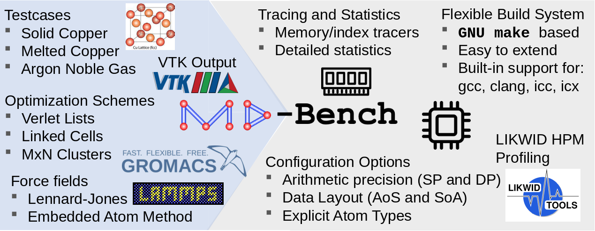

# MD-Bench



A generic proxy-app toolbox for state-of-the-art molecular dynamics algorithms

## Build instructions

Properly configure your building by changing `config.mk` file. The following options are available:

- **TAG:** Compiler tag (available options: GCC, CLANG, ICC, ONEAPI, NVCC).
- **ISA:** Instruction set (available options: SSE, AVX, AVX2, AVX512).
- **MASK\_REGISTERS:** Use AVX512 mask registers (always true when ISA is set to AVX512).
- **OPT\_SCHEME:** Optimization algorithm (available options: lammps, gromacs).
- **ENABLE\_LIKWID:** Enable likwid to make use of HPM counters.
- **DATA\_TYPE:** Floating-point precision (available options: SP, DP).
- **DATA\_LAYOUT:** Data layout for atom vector properties (available options: AOS, SOA).
- **ASM\_SYNTAX:** Assembly syntax to use when generating assembly files (available options: ATT, INTEL).
- **DEBUG:** Toggle debug mode.
- **EXPLICIT\_TYPES:** Explicitly store and load atom types.
- **MEM\_TRACER:** Trace memory addresses for cache simulator.
- **INDEX\_TRACER:** Trace indexes and distances for gather-md.
- **COMPUTE\_STATS:** Compute statistics.

Configurations for LAMMPS Verlet Lists optimization scheme:
- **ENABLE\_OMP\_SIMD:** Use omp simd pragma on half neighbor-lists kernels.
- **USE\_SIMD\_KERNEL:** Compile kernel with explicit SIMD intrinsics.

Configurations for GROMACS MxN optimization scheme:
- **USE\_REFERENCE\_VERSION:** Use reference version (only for correction purposes).
- **XTC\_OUTPUT:** Enable XTC output.
- **HALF\_NEIGHBOR\_LISTS\_CHECK\_CJ:** Check if j-clusters are local when decreasing the reaction force.

Configurations for CUDA:
- **USE\_CUDA\_HOST\_MEMORY:** Use CUDA host memory to optimize host-device transfers.

When done, just use `make` to compile the code.
You can clean intermediate build results with `make clean`, and all build results with `make distclean`.
You have to call `make clean` before `make` if you changed the build settings.

## Usage

Use the following command to run a simulation:

```bash
./MD-Bench-<TAG>-<OPT_SCHEME> [OPTION]...
```

Where `TAG` and `OPT_SCHEME` correspond to the building options with the same name.
Without any options, a Copper FCC lattice system with size 32x32x32 (131072 atoms) over 200 time-steps using the Lennard-Jones potential (sigma=1.0, epsilon=1.0) is simulated.

The default behavior and other options can be changed using the following parameters:
```
-p <string>:          file to read parameters from (can be specified more than once)
-f <string>:          force field (lj or eam), default lj
-i <string>:          input file with atom positions (dump)
-e <string>:          input file for EAM
-n / --nsteps <int>:  set number of timesteps for simulation
-nx/-ny/-nz <int>:    set linear dimension of systembox in x/y/z direction
-r / --radius <real>: set cutoff radius
-s / --skin <real>:   set skin (verlet buffer)
--freq <real>:        processor frequency (GHz)
--vtk <string>:       VTK file for visualization
--xtc <string>:       XTC file for visualization
```

## Examples

## Citations

R. Ravedutti Lucio Machado, J. Eitzinger, H. Köstler, and G. Wellein: MD-Bench: A generic proxy-app toolbox for state-of-the-art molcular dynamics algorithms. Accepted for [PPAM](https://ppam.edu.pl/) 2022, the 14th International Conference on Parallel Processing and Applied Mathematics, Gdansk, Poland, September 11-14, 2022. PPAM 2022 Best Paper Award. Preprint: [arXiv:2207.13094](https://arxiv.org/abs/2207.13094)

## Credits

MD-Bench is developed by the Erlangen National High Performance Computing Center ([NHR@FAU](https://hpc.fau.de/)) at the University of Erlangen-Nürnberg.

## License

[LGPL-3.0](https://github.com/RRZE-HPC/MD-Bench/blob/master/LICENSE)
