<!-----------------------------------------------------------------------------
This document should be written based on the Github flavored markdown specs:
https://github.github.com/gfm/
It can be converted to html or pdf with pandoc:
pandoc -s -o logbook.html  -f gfm -t html logbook.md
pandoc test.txt -o test.pdf
or with the kramdown converter:
kramdown --template document  -i GFM  -o html logbook.md

Optional: Document how much time was spent. A simple python command line tool
for time tracking is [Watson](http://tailordev.github.io/Watson/).
------------------------------------------------------------------------------>

# MuCoSim: MD-Bench on Cuda
[TOC]
## Project Description

### Customer Info

* Name: Martin Bauernfeind
* E-Mail: [martin.m.bauernfeind@fau.de](mailto:martin.m.bauernfeind@fau.de)

-----

### Application Info

* Code: MD-Bench on Cuda
* URL: https://github.com/RRZE-HPC/MD-Bench/tree/mucosim_cuda

The original MD-Bench is a mini-app to simulate molecular dynamics.
Its code is written in sequential C with less than 1000 lines of code.
MD-Bench on Cuda is aimed to port this code to Cuda to use the power of massive parallelism on GPGPUs.
Even though many parts are already ported to Cuda, significant parts still remain in C and therefore on the CPU.

*Note: The words particle and atom will be used interchangeably

-----

MD-Bench emulates such molecular dynamics by calculating the interactions among particles and how these affect their motion.
The simulation system's constituents are
* Number of atoms with initial state (position & velocity)
* Boundary conditions (periodic)

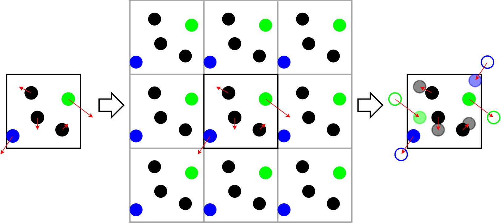

-----

The force of each atom is based on its interaction with neighboring atoms. In MD-Bench, the Lennard-Jones potential is used to model the potential among
pairs of particles, here: electronically neutral atoms. This potential models repulsive as well as attractive interactions:

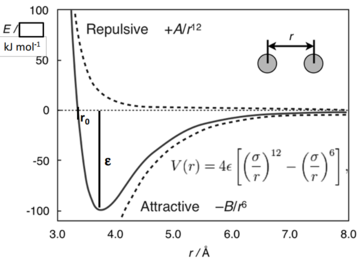

where
* ***r*** is the distance between the two interacting atoms, 
* ***ε*** is the dispersion energy and
* ***σ*** the distance at which the particle-potential ***V*** is zero

-----

What can be observed from this graph is:
* The Lennard-Jones potential is a simplified model but still describes the essential aspects of particle dynamics
* Particles repel each other at close distances, attract each other at medium distances and have close to zero interaction at large distances
-----

The simulation now runs similar to the sketch code below. Every timestep we iterate over all particles and compute interactions with their neighbors. Two particles/atoms are considered neighboring if the distance between them is below a certain threshold that has already been determined by earlier contributors. 

```python
for t in timesteps:
  #GPU-parallel-for atom in atoms:
    velocity[atom] += force[atom]
    position[atom] += velocity[atom]

  if t % 20 == 0:
    neighbors = calculateNeighbors()

  #GPU-parallel-for atom in atoms:
    neighbors = neighbors[atom]
    force = 0.0
    for neighbor in neighbors:
        radius = calc_radius(...)
        if radius < close_enough:
            force += calc_force(...)
    forces[atom] += force
```

Some parts already have been ported to GPU. More on that in a later chapter.

-----

### Testsystem

* Host/Clustername: alex
* Cluster Info URL: <https://hpc.fau.de/systems-services/systems-documentation-instructions/clusters/alex-cluster/>
* Total GPU count: 304 Nvidia A40, 160 Nvidia A100/40GB, and 96 A100/80GB
* per node:
  * CPU: 2x AMD EPYC 7713 “Milan” (64 cores per chip) @ 2.0 GHz - SMT disabled -> 1 Thread/CPU
  * Memory capacity: [512 GB | 1024 GB | 512 GB]
  * GPU: [8x A100/40GB | 8x A100/80GB | 8x A40/48GB]
* Info on single node jobs: <https://hpc.fau.de/systems-services/systems-documentation-instructions/clusters/alex-cluster/#batch>
* resources per GPU:
  * [A40 | A100]
  * CPU: [16 / GPU | 16 / GPU]
  * Memory: [60GB / GPU | 120GB / GPU]
  
**Note**: each an A40 has about double the single precision processing power of an A100 despite being cheaper

-----
### Software Environment

**Compiler**:

* Compiler: NVCC (cuda/11.6.1)
* Operating System: Ubuntu 20.04.3 LTS
* Addition libraries:
  * LIKWID 5.2.0

### How to build software

```
$ git clone https://github.com/RRZE-HPC/MD-Bench/tree/mucosim_cuda
$ cd MD-Bench
$ module load likwid cuda
$ make
```

-----
### Testcase description

If not stated otherwise these are the conditions for the simulation benchmarking.
* the number of simulated atoms is 131072
* floating numbers use double precision
* force computation between atoms uses the lennard-jones model
* one gpu with its associated cores are used for computation

### How to run software

```
$ module load likwid cuda
$ cd MD-Bench
$ make
$ ./MDBench-NVCC
```
-----
## Initial: GPU Thread Scaling runs
We start with doing a small collection of runs scaling in number of GPU threads per block.
The output of our programm always contains one line that displays the number of atom updates per second derived from the total number of atom updates simulated diveded by the program runtime.
This line always looks like this:
```
Performance: 7.18 million atom updates per second
```
-----
Now we plot the single- and double-precision performance for linearly increasing numbers of `NUM_THREADS` from 1 to 32:


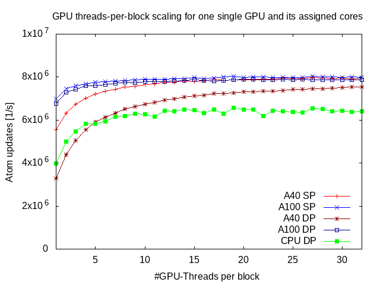

In low thread counts (1-8) the program runs slower on the A40 than the A100.
For increasing threadcounts (9-32) the application performance in regards to simulation throughput seems to converge.
Contrary to intuition the convergence points seem to be the same for the A40 in single precision and A100 in single and double precision.
This may hint at performance bottlenecks independent of the selected gpu.

-----
## Profiling the application

In order to find such a bottleneck the runtime behaviour of the application is monitored with the command line tool `nsys`:
```
srun nsys profile -o ./a40_profiling_run
```

Running this command in a job script or an interactive session yields a .nsys-rep file which can be opened with the Nvidia Nsight Systems tool.

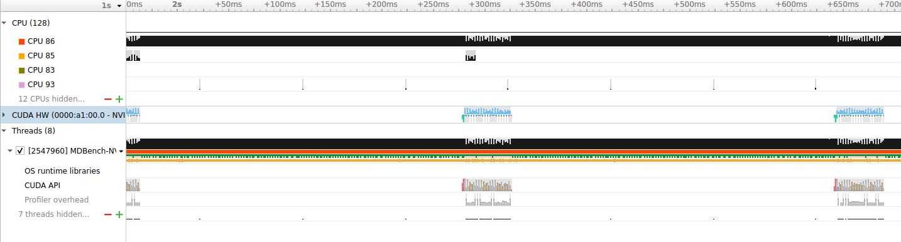

Activity in the application is cyclic. In each cycle one of the CPUs runs for a majority of the cycle while the rest mostly idle. The rest of the time is spent in multiple kernels running on the GPU.
This shows that most of the time is still spent on CPU.

-----
### Finding where the CPU time is spent

Using the command line tool `gprof` we can see that most of the CPU time is in the buildNeighbor-function


```
Flat profile:

Each sample counts as 0.01 seconds.
  %   cumulative   self              self     total           
 time   seconds   seconds    calls  ms/call  ms/call  name    
 97.70      3.35     3.35       11   304.65   306.47  buildNeighbor
  0.87      3.38     0.03      201     0.15     0.15  updatePbc
  0.58      3.40     0.02  2359296     0.00     0.00  myrandom
  0.58      3.42     0.02       11     1.82     1.82  binatoms
  0.29      3.43     0.01       11     0.91     0.91  setupPbc
  0.00      3.43     0.00     1668     0.00     0.00  checkCUDAError
  0.00      3.43     0.00      426     0.00     0.00  getTimeStamp
  0.00      3.43     0.00      201     0.00     0.00  computeForce
  0.00      3.43     0.00      200     0.00     0.00  cuda_final_integrate
  0.00      3.43     0.00      200     0.00     0.00  cuda_initial_integrate
  0.00      3.43     0.00       48     0.00     0.00  reallocate
  0.00      3.43     0.00       10     0.00   307.53  reneighbour
  0.00      3.43     0.00       10     0.00     0.00  updateAtomsPbc
...
```
-----
The standard program output also tells us in how much time (in total for CPU and GPU) is used for neigbor selection and force computation. The numbers will probably not match perfectly since gprof only samples the CPU.

```
TOTAL 3.47s FORCE 0.21s NEIGH 3.15s REST 0.12s
```

Even when considering CPU and GPU time the neighbor calculation needs most of the time.

-----
### Reasons for this runtime profile

In order to understand the runtime profile of the code we can take a look at the control flow of the program:

The force computation and the force integration are already running in parallel on the GPU. Those force computation and force integrations correspond to the short burst of GPU activity in the runtime profile shown by `nsys`. The neighborhood calculation on the other hand is still running sequentially on the CPU. This corresponds to the majority of the time spent on the CPU with only one core working and the rest idling.

```python
for t in timesteps:
  #GPU-parallel-for atom in atoms:
    velocity[atom] += force[atom]
    position[atom] += velocity[atom]
    

  if t % 20 == 0:
    neighbors = calculate_neighbors()

  
  #GPU-parallel-for atom in atoms:
    neighbors = neighbors[atom]
    force = 0.0
    for neighbor in neighbors:
        radius = calc_radius(...)
        if radius < close_enough:
            force += calc_force(...)
    forces[atom] += force
```
-----
## Parallelizing neighborhood calculation

Being able to parallelize this neighborhood calculation requires to understand it first.
The real application simulates a 3D space. For brevity all code examples written in pseudo-python assume a 2D simulated area.

```python
def calculate_neighbors():
  update_according_to(atoms, periodic_boundary_condition)
  setup_periodic_boundary_condition(atoms, periodic_boundary_condition)
  update_periodic_boundary_condition(atoms, periodic_boundary_condition)
  neighbor_list = build_neighbor(atoms)
  return neighbor_list
``` 

A short explanation:
* the `update_according_to` method sets the position of all atoms that have left the simulated area so they enter on the 'other' side
* the `setup_periodic_boundary_condition` method creates ghost atoms that emulate force interaction of atoms through the periodic boundary
* the `update_periodic_boundary_condition(...)` method sets the ghost atoms position so they have the right offset to their original atom
* the `build_neighbor(...)` method then constructs the neighbor lists

### Building neighbor lists
The majority of CPU time is spent the `buildNeighbor`-method. Parallelizing this on the GPU will have significant impact on the application's scalability.

```python
def buildNeighbor(atoms):
  max_neighbors_per_atom = some_value
  new_max_neighbors_per_atom = max_neighbors_per_atom
  grid_cells = sort_into(atoms)
  neighbor_list = malloc(n_atoms * max_neighbors * sizeof(int))
  neighbor_counters = malloc(n_atoms * sizeof(int))
  
  resize_needed = true
  while(resize_needed):
    new_max_neighbors_per_atom = max_neighbors_per_atom
    resize_needed = false
    for atom in atoms:
      neighbor_count = 0
      grid_cell = grid_cell_of(position[atom])
      for neighboring_cell in neighboring_cells(grid_cell):
        for possible_neighbor in neighboring_cell.atoms:
          if distance(atom, possible_neighbor) < threshold:
            neighbor_list[atom * max_neighbors_per_atom + neighbor_count] = possible_neighbor
            neighbor_count++
      if neighbor_count > max_neighbors_per_atom:
        resize_needed = true
        if neighbor_count > new_max_neighbor_count_per_atom:
          new_max_neighbor_count_per_atom = neighbor_count
    if resize_needed:
      max_neighbors_per_atom = new_max_neighbors_per_atom * 1.2
      free(neighbor_list)
      neihgbor_list = malloc(n_atoms * max_neighbors * sizeof(int))
```

### Parallelizing building neighbor lists
* Parallelization idea: 
  * give each atom one gpu-thread
* Challenge:
  * CPU version sets variable visible from outside of the loop if maximum length of neighbor list is too small to fit all neighbors
  * &#8594; allocate memory for such a variable on the GPU 
  * &#8594; wrap access to that memory address in a CAS in the kernel to avoid race conditions
  * &#8594; access it only if neighbor list is to small to fit all neighbors
  * &#8594; after kernel has finished copy it back to CPU
  * &#8594; if neighbor list was to small to fit all neighbor lists increase maximum amount of neighbors for each atom and rerun the kernel

With this the building of the neighbor list can be done easily:
* convert the used submethod of finding the right bin for a given position to a device funtion
  * contains only read accesses to global variables  &#8594; pass values of needed global variables as extra function parameters and access these parameters instead

For now only the loop body that actually builds the neighbor lists has been ported as it contains the majority of the workload. The portin of the rest of the buildNeighbor method (i.e. mostly the atom binning) is postponed as it most likely is not performance critical at this stage.

#### Effects on runtime
With the neighbor list building loop ported to cuda we see some improvements in program runtime.
* A40:
  * Before:&nbsp;``` TOTAL 3.46s FORCE 0.21s NEIGH 3.14s REST 0.12s ```
  * After:&nbsp;&nbsp;&nbsp;&nbsp;```TOTAL 0.37s FORCE 0.21s NEIGH 0.06s REST 0.09s```
* A100:
  * Before:&nbsp;``` TOTAL 3.01s FORCE 0.05s NEIGH 2.84s REST 0.12s ```
  * After:&nbsp;&nbsp;&nbsp;&nbsp;```TOTAL 0.18s FORCE 0.05s NEIGH 0.04s REST 0.10s```
  
As expected we see the runtime spent in the neighborhood computation drop significantly

  With such a reduction in runtime the performance has obviously increased:
* A40:
  * Before:&nbsp;```Performance: 7.59 million atom updates per second```
  * After:&nbsp;&nbsp;&nbsp;&nbsp;```Performance: 71.79 million atom updates per second```
* A100
  * Before:&nbsp;```Performance: 7.93 million atom updates per second```
  * After:&nbsp;&nbsp;&nbsp;&nbsp;```Performance: 143.60 million atom updates per secon```
  
Apart from the reduction in runtime we see also, that the traffic between device and host has decreased
from:
```
Total       Count   Avg         Min         Max         Operation
1,36 GiB    229     6,08 MiB    128 B       50,00 MiB   [CUDA memcpy HtoD]
660,00 MiB  220     3,00 MiB    3,00 MiB    3,00 MiB    [CUDA memcpy DtoH]

```
to:
```
Total       Count   Avg         Min         Max         Operation
881,28 MiB  240     3,67 MiB    128 B       4,12 MiB    [CUDA memcpy HtoD]
660,00 MiB  231     2,86 MiB    4 B         3,00 MiB    [CUDA memcpy DtoH]
44 B        11      4 B         4 B         4 B         [CUDA memset]
```

With this the scaling behaviour also improves:

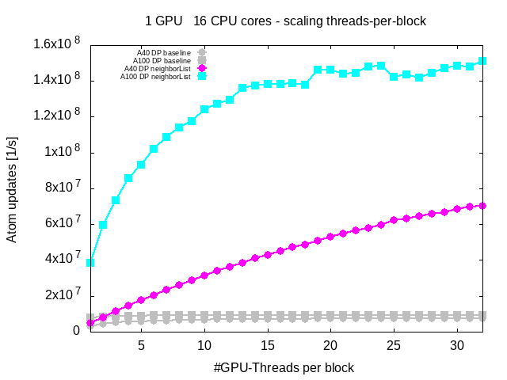

#### Effects on profile

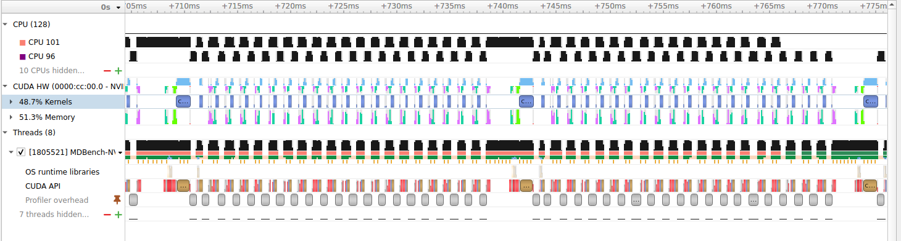

Profiling the program now with nsys shows that the long periods where only one CPU was active (with the rest of the CPUs and the GPU idling) are now much shorter.
Hence the GPU utilization is better with this change. The visible gaps where only CPU 2 is active are mostly due to the profiler flushing its buffers and do not contribute to runtime in a non-profiliing run.

## Parallelizing further components

### Parallelizing updating the PBC
Since the positions of the original atoms are updated every timestep, we need to update the position ghost atoms every timestep. This is done in the updatePBC method.

```python
def update_bondary_condition(atoms, periodic_boundary_condition):
  for ghost in ghosts:
    position[ghost].x = ghost.offset_x + position[ghost.original].x
    position[ghost].y = ghost.offset_y + position[ghost.original].y
```

Idea:
 * give each atoms its own gpu-thread
 
Special Challenges:
 * None (since each ghost atom only writes atom-local data and all reads are from atom local data or data not changed in this kernel (&#8594; can be considered static during kernel runtime) &#8594; no race conditions)

With the parallelization of this method the runtime drops even further probably due to the whole loop except reneighboring running entirely on the GPU:


* A40:
  * Before:&nbsp;```TOTAL 0.37s FORCE 0.21s NEIGH 0.06s REST 0.09s```
  * After:&nbsp;&nbsp;&nbsp;&nbsp;```TOTAL 0.30s FORCE 0.21s NEIGH 0.08s REST 0.01s```
* A100:
  * Before:&nbsp;```TOTAL 0.18s FORCE 0.05s NEIGH 0.04s REST 0.10s```
  * After:&nbsp;&nbsp;&nbsp;&nbsp;```TOTAL 0.11s FORCE 0.05s NEIGH 0.05s REST 0.01s```


Since the reneighboring happens only every 20 timesteps this means that the GPU can run for almost 20 timesteps uninterrupted (there are other small interruptions due to synchronous memcopies from device to host for computing stats (e.g. temperature and pressure) on the CPU, but these run only rarely (e.g. in the case of temperature and pressure every 100 timesteps))
This can also be seen in ``nsys``:

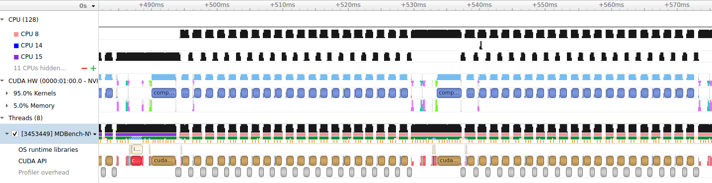

***Note***: In the loop (the many small GPU acitivity bursts after the long kernel) there are no memory transfers between device and host.

With this also the memory traffic between host and device has decreased both in total memory transferred as well as frequency:

* From:
```
Total       Count  Avg        Min     Max       Operation
881,28 MiB  240    3,67 MiB   128 B   4,12 MiB  [CUDA memcpy HtoD]
660,00 MiB  231    2,86 MiB   4 B     3,00 MiB  [CUDA memcpy DtoH]
44 B        11     4 B        4 B     4 B       [CUDA memset]
```
* To:
```
Total       Count  Avg        Min     Max       Operation
184,76 MiB  64     2,89 MiB   4 B     4,12 MiB  [CUDA memcpy DtoH]
116,13 MiB  105    1,11 MiB   128 B   4,12 MiB  [CUDA memcpy HtoD]
44 B        11     4 B        4 B     4 B       [CUDA memset]
```

Porting this method to cuda also improves scaling:

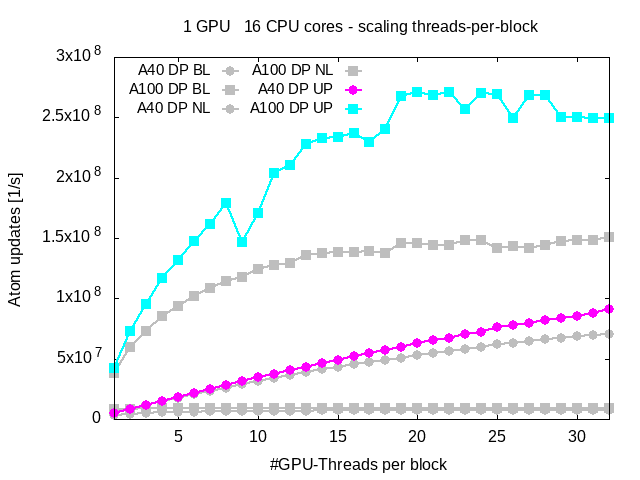

There is a moderate increase in performance for the A40 and a massive performance increase for the A100.


### Porting atom binning to cuda
The only part of the loop remaining partly on the CPU is the reneighboring phase.
In order to complete porting the whole `buildNeighbor` method to cuda we port the atom binning, since the neighbor list construction has already been ported.

***Note***: In pseudo-code the atom binning is called sort_into in the `buildNeighbor` function:
```python
grid_cells = sort_into(atoms)
```

in the code it looks similar to this:
```python
def sort_into(atoms):
  ngrids = number_of_grid_cells
  grid_cell_content_counters = malloc(ngrids * sizeof(int))
  resize_needed = true
  
  do:
    resize_needed = false
    grid_cells = malloc(ngrids * max_atoms_per_grid_cell * sizeof(int))
    for grid_cell_counter in grid_cell_counters:
      grid_cell_counter = 0
    for atom in atoms:
      index = grid_cell_of(position[atom])
      index_in_grid_cell = grid_cell_counter[index]++
      if index_in_grid_cell < max_atoms_per_grid_cell:
        grid_cells[index * max_atoms_per_grid_cell + index_in_grid_cell] = atom
      else:
        resize_needed = true
    if resize_needed:
      ngrids *= 2
  while resize_needed
  return grid_cells
```

For parallelizing:
* Idea: convert the loop initializing all counters with 0 to a memset and give each atom one gpu-thread
* Special Challenges:
  * Signaling from inside the kernel to the launching method if not enough memory per atom is available to fit all atom indices contained in the grid cell/bin  
&#8594; use same technique as for porting the neighbor list construction loop (i.e. in the kernel: write to special memory address initialized with 0 if not enough space - from launching method: check if memory address still contains initialization value (0 here))
  * concurrent accesses to a grid cell content counter (counter of how many atoms a grid cell contains) possible  
  &#8594; wrap with atomicAdd
  * method taking an atom position and returning its correspondent grid cell/bin needed  
  &#8594; reuse the method created for use the neighbor list construction kernel (see 'Parallelizing building neighbor lists')

Porting this part reflects in a small runtime reduction:

* A40:
  * Before:&nbsp;```TOTAL 0.30s FORCE 0.21s NEIGH 0.08s REST 0.01s```
  * After:&nbsp;&nbsp;&nbsp;&nbsp;```TOTAL 0.28s FORCE 0.21s NEIGH 0.05s REST 0.01s```
* A100:
  * Before:&nbsp;```TOTAL 0.11s FORCE 0.05s NEIGH 0.05s REST 0.01s```
  * After:&nbsp;&nbsp;&nbsp;&nbsp;```TOTAL 0.09s FORCE 0.05s NEIGH 0.03s REST 0.02s```


This leads to an increase in performance:

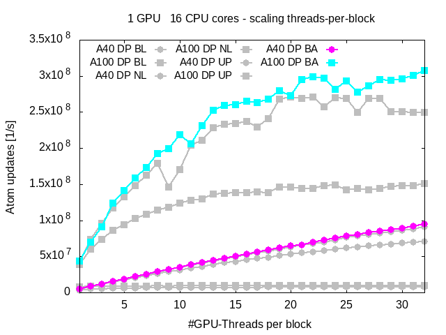


### Porting updateAtomsPbc
The last method ported here is the updateAtomsPbc method which enforces the boundary condition on atoms that have left the simulation domain between the last and this reneighboring.

Atoms that have left the simulated area will enter the simulated area on the mirrored side. In code it looks like this:

```python
def update_according_to(atoms, periodic_boundary_condition):
  sim_width, sim_height = periodic_boundary_condition.simulated_area.dims
  x_max, x_min, y_max, y_min = periodic_boundary_condition.boundaries
  for atom in atoms:
    if position[atom].x > x_max:
      position[atom].x -= sim_width
    if position[atom].x < x_min:
      position[atom].x += sim_width
    if position[atom].y > y_max:
      position[atom].y -= sim_height
    if position[atom].y < y_min:
      position[atom].y += sim_height
```

* Idea:
  * give each atom one gpu-thread
* Special Challenges:
  * None: each atom works only atom local data and reads some data from global variables (e.g. size of the simulated area)
    * pass values of needed global variables as parameters as done for other ported methods before

This has an almost indistinguishable effect on runtime:

* A40:
  * Before:&nbsp;```TOTAL 0.28s FORCE 0.21s NEIGH 0.05s REST 0.01s```
  * After:&nbsp;&nbsp;&nbsp;&nbsp;```TOTAL 0.27s FORCE 0.21s NEIGH 0.05s REST 0.01s```
* A100:
  * Before:&nbsp;```TOTAL 0.09s FORCE 0.05s NEIGH 0.03s REST 0.02s```
  * After:&nbsp;&nbsp;&nbsp;&nbsp;```TOTAL 0.09s FORCE 0.05s NEIGH 0.03s REST 0.02s```

The timers used for measurements do have finer resolution as the 10's of milliseconds portrayed here.
However using this resolution would not yield better results in our case as only small random fluctuations can (due to the low runtimes) result in large differences/high variance in atom throughput.
This variance is also shown in the scaling behaviour plot:

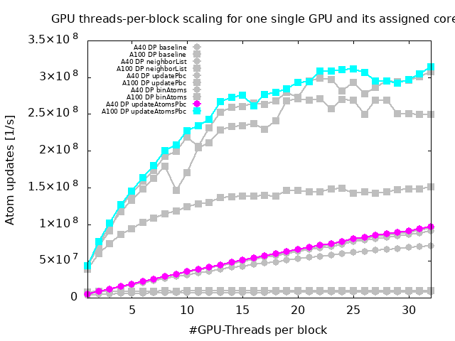

### Analysis of setupPbc

The last method in the reneighboring step remaining unported is the setupPbc method.
This method creates the ghost atoms that are to emulate the interactions of two atoms via the periodic boundary.
A ghost atom for a certain combination of all cardinal directions ('up', 'down', 'left', 'right', 'front', 'back') only needs to be created if the original atom is close enough to the periodic boundary in all of the directions in the combination.
In the code it looks similar to this pseudo-code:

```python
def setup_periodic_boundary_condition(atoms, periodic_boundary_condition):
  sim_width, sim_height = periodic_boundary_condition.simulated_area.dims
  x_max, x_min, y_max, y_min = periodic_boundary_condition.boundaries
  n_ghosts = 0
  n_ghost_allocations = some_value
  ghosts = malloc(n_ghost_allocations * sizeof(ghost))
  
  def createGhost(original_atom, offset_x, offset_y):
    ghost = {}
    ghost.original = original_atom
    ghost.offset_x = offset_x
    ghost.offset_y = offset_y
    return ghost
  
  for atom in atoms:
    if n_ghost_allocations - n_ghosts < max_ghosts_created_per_iteration:
      ghosts = realloc(ghosts, n_ghost_allocations, n_ghost_allocations + some_more)
      n_ghost_allocations += some_more
    if position[atom].x > x_max - threshold:
      ghosts[n_ghosts++] = createGhost(atom, -sim_width, 0)
    if position[atom].x < x_min + threshold:
      ghosts[n_ghosts++] = createGhost(atom, +sim_width, 0)
    if position[atom].y > y_max - threshold:
      ghosts[n_ghosts++] = createGhost(atom, 0, -sim_height)
    if position[atom].y < y_min + threshold:
      ghosts[n_ghosts++] = createGhost(atom, 0, +sim_height)
    if position[atom].x > x_max - threshold AND position[atom].y > y_max - threshold:
      ghosts[n_ghosts++] = createGhost(atom, -sim_width, -sim_height)
    if position[atom].x > x_max - threshold AND position[atom].y < y_min + threshold:
      ghosts[n_ghosts++] = createGhost(atom, -sim_width, +sim_height)
    if position[atom].x < x_min + threshold AND position[atom].y > y_max - threshold:
      ghosts[n_ghosts++] = createGhost(atom, +sim_width, -sim_height)
    if position[atom].x < x_min + threshold AND position[atom].y < y_min + threshold:
      ghosts[n_ghosts++] = createGhost(atom, +sim_width, +sim_height)
  
  if n_atoms + n_ghosts > len(atoms):
    atoms = realloc(n_atoms + n_ghosts)
```

Due to time constraints this method will not be ported, but the challenges to port this method to CUDA will be analyzed.

* Idea:
  * give each atom on gpu-thread
* Special challenges: lots of dependencies between loop iterations
  * conditional allocation of more memory to store all ghost atoms possibly generated in this loop iteration
    * &#8594; take upper limit of ghost count for allocation
      * &#8594; very large unused memory (27 possible ghosts per atom)

     OR
    * &#8594; allocate memory in batches and run several iterations together in one kernel
      * max parallism of the GPU might not be reached
  * conditional increment of the `n_ghosts` variable &#8594; data race condition
    * wrap in CAS or atomicAdd
      * many threads (possibly all at once) competing for changing one memory address (where `n_ghosts` variable is stored)
      
Due to all of these challenges porting this method to CUDA in the conventional way will most likely yield poor performance.

## Whole application scaling behaviour after parallelizing

In order to extend runtimes (and therefore dampen the effects of random fluctuations) we increase the workload by increasing the length of our simulation from 200 to 2000 timesteps.
Additionally a larger domain size with up to 1048576 atoms (instead of before 131072) is tested.

The runtimes for default runs (32 threads per block) are now:
* A40:
```
System: 1048576 atoms 173434 ghost atoms, Steps: 2000
TOTAL 19.57s FORCE 15.49s NEIGH 3.15s REST 0.93s
```
* A100:
```
System: 1048576 atoms 173434 ghost atoms, Steps: 2000
TOTAL 4.27s FORCE 2.14s NEIGH 1.54s REST 0.59s
```

With this the force computation is the main bottleneck.
A look into the cuda profiler confirms this:

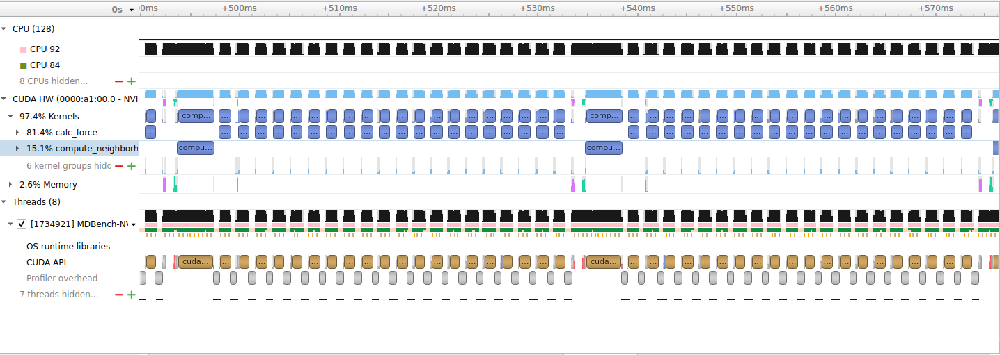

However memory transfers still take some time:

```
Time	 Total Time	Count	Min	      Max          Operation
67.0%	310,648 ms	523	1,344 μs	475,849 μs	[CUDA memcpy DtoH]
32.0%	150,418 ms	613	1,023 μs	411,571 μs	[CUDA memcpy HtoD]
0.0% 	519,530 μs	307	  991 ns  	898 ns	  [CUDA memset]
```

In the case of the A40 with a runtime of ~19.5 seconds this is not a significant portion.
For the A100 with a total runtime of ~4.3 seconds this represents ~10.8% of the total program runtime.

### Runtime spent in the neighbor computation

In order to find hotspots in the neighborhood computation we instrument the neighborhood calculation with timestamps.
The runtime spent is summed up over all timesteps for each section and then printed.
For the A40 we get a result like this:

* A40:
```
NEIGH 3.15s
NEIGH_TIMERS: 
UPD_AT: 0.10s 
SETUP_PBC 0.57s 
UPDATE_PBC 0.20s 
BINATOMS 0.02s 
BUILD_NEIGHBOR 2.31s
```

* A100:
```
NEIGH 1.54s 
NEIGH_TIMERS: 
UPD_AT: 0.11s 
SETUP_PBC 0.49s 
UPDATE_PBC 0.19s 
BINATOMS 0.02s 
BUILD_NEIGHBOR 0.78s
```


### Scaling beyond 32 threads per block

Up to now only scaling until 32 GPU-threads per block have been examined.
However the scaling trend might now continue further than before the porting.
Therefore the next test does scale the amout of threads exponentially by a factor of 2 from 32 to 1024.
Additionally we take different sizes for the number of atoms to find out, whether the program with the new neighborhood calculation still operates at max capacity with the the initial of size of 131072 atoms.


* A40:

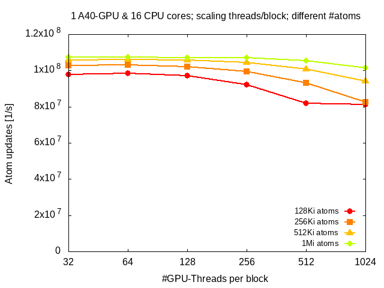

The A40 does not scale well beyond 32 threads per block with performance even reducing.
Increasing the number of atoms in the domains yields only small performance/throughput gains.
The dropoff in performance with larger numbers of threads per block is less severe for a high number of atoms in the domain.

* A100

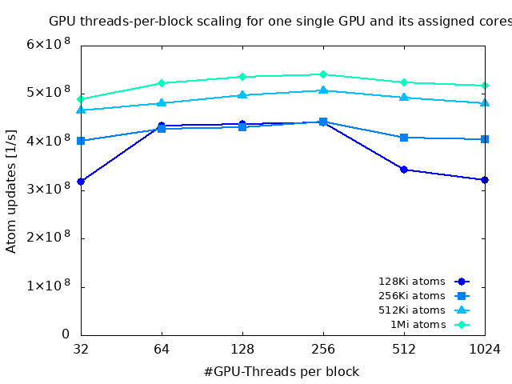

The A100 scales much better both with more threads per block and more atoms in the domain.
Around 256 threads per block the maximum seems to be reached.


### Neighborhood and force computation performance

Since earlier chapters mostly only focused on the whole application, this section will briefly examine the major time contributing parts, which are the force computation and the neighbor list construction.
Here we scale the number of threads per block exponentially and measure the runtimes needed by the respective methods.


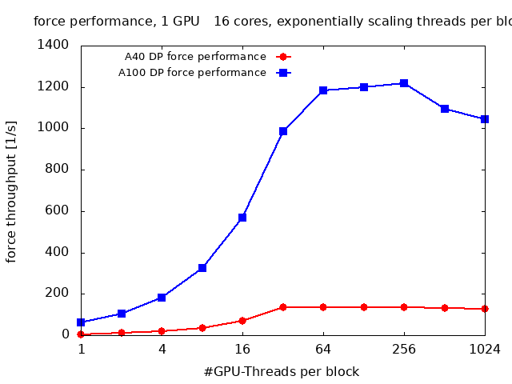

On the A40 both force computation and neighbor list construction gain performance until about 32 threads per block.
In contrast to that on the A100 the force computation reaches its peak performance around 256 threads per block while the performance of neighbor list construction keeps increasing until 1024 threads per block which is the upper limit in this test.

The reason that the A100 can benefit from more threads per block in this case is probably due to the larger L1 caches (A40: 128 KiB/SM vs A100: 192 KiB/SM) and the much larger L2 cache (A40: 6 MiB vs A100: 40 MiB) enabling better latency hiding.

***For chache sizes see:***
 * A40:  https://www.nvidia.com/content/PDF/nvidia-ampere-ga-102-gpu-architecture-whitepaper-v2.pdf
 * A100: https://images.nvidia.com/aem-dam/en-zz/Solutions/data-center/nvidia-ampere-architecture-whitepaper.pdf


Using the tool `ncu` we obtain a roofline model for the respective kernels:

***Note:*** For the A40 we choose 32 threads per block and for the A100 256 threads per block as this are roughly the numbers of threads where these GPUs stop scaling well with threads per block. This is done to find hints on the performance bottlenecks for those kernels.

* neighbor list construction
```
GPU   Arith. Intensity        Througput     Memory Throughput
A40   6.6 - 10.5 FLOP/byte    147 GFLOP/s   17 GB/s
A100  3.75 - 7.9 FLOP/byte    707 GFLOP/s   135 GB/s
```
  * A40 roofline:
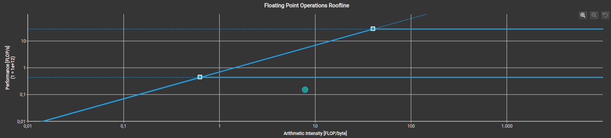
  * A100 roofline:
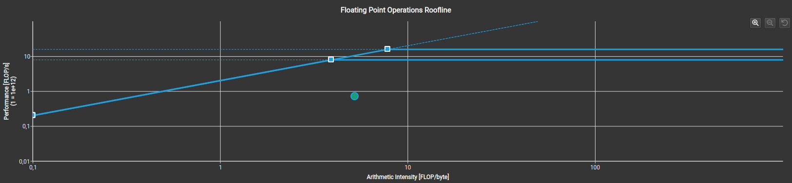

* force computation
```
GPU   Arith. Intensity        Througput     Memory Throughput
A40   ~4.95 FLOP/byte         211 GFLOP/s   40 GB/s
A100   5.1 - 5.5 FLOP/byte    2.2 TFLOP/s   410 GB/s
```
  * A40 roofline:
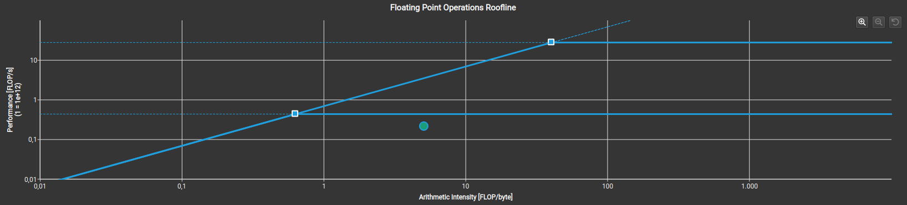
  * A100 roofline:
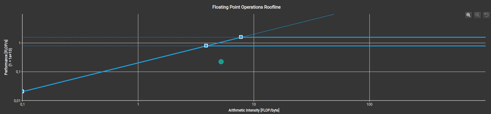

From this we can see that in neither configuration and kernel the GPUs are at their computational or memory transfer limit.
In order to work out the real bottlenecks for both of those kernels more research is needed.

***Observation:***  
The computational intensity decreases over the runtime of the program.  
This is due to the memory location of each atom remaining the same while its position in the simulation will change. Hence the atoms belonging together into a grid cell / bin scatter more the longer the program runs making more loads per neighbor computation necessary.

## Summary

At the start we discovered that the neighborhood computation was using the majority of the program runtime.
We could speed up the neighborhood computation by porting it from sequential C code to Cuda.
Hence the runtime of the whole program has decreased significantly increasing its throughput many times over.
This speedup could be achieved by a higher GPU utilization.

* Speedup:
  * A40:
    * single precision (SP): speedup of factor 26 - 27
    * double precision (DP): speedup of factor 10 - 11
    
  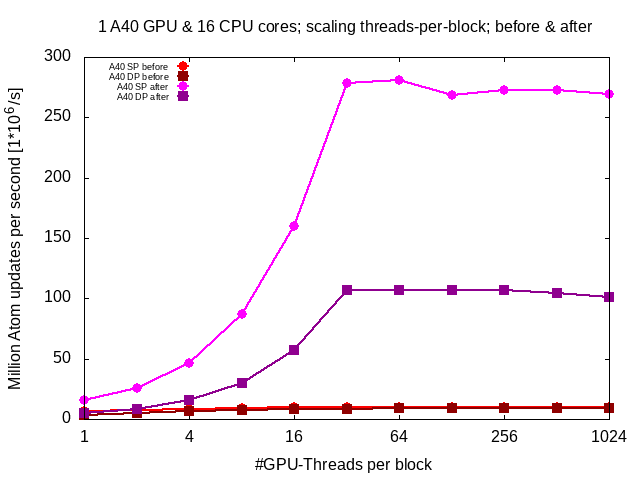

  * A100:
    * single precision (SP): speedup of factor ~ 55
    * double precision (DP): speedup of factor ~ 80
    
  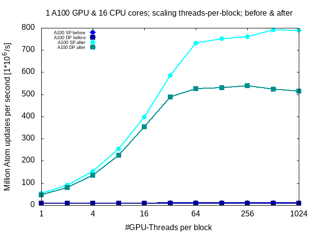


## Future work
In this section we will outline important starting points for future research:

* finding the bottlenecks of the neighbor construction and the force kernel
  * will probably also reveal the true reason for the discrepancy between only a moderate factor in program performance (factor of ~ 5x between A40 and A100) despite a large factor (~ 19x between A40 and A100 in double precision) in computational performance
* parallelizing the creation of ghost atoms
* sorting the atoms with their grid cell / bin as key so atoms of the same grid cell are near in memory

# Outline for possible parallelization of setupPbc

Due to the challenges for porting setupPbc with keeping the same control flow, we outline a different solution.
Our solution adjusts the control flow so that the ghost creation does not need many small memory allocations in a loop and allows the ghost atoms to be stored densely.

Steps with descriptions:

0. Update all atom positions according to the periodic boundary condition
1. Bin all normal atoms (i.e. without the ghost atoms)
2. For all bins determine how many ghost atoms are needed for all atoms contained in each bin &#8594; store this value in an array we will call `ghostcount` (i.e. similar to bincount)
3. Compute exclusive prefix sum over the `ghostcount` array &#8594; now we now the memory area where the ghosts from atoms contained in a particular grid cell are stored
4. Create ghost atoms with this knowledge
5. Run the ghost position update to initialize the ghost positions
6. Bin ghost atoms according to their position
7. Build neighbor lists as without binning the atoms (since this has been done already)

How it would look in our python-pseudo-code:

```python
def calculate_neighbors():
  update_according_to(atoms, periodic_boundary_condition) # from earlier chapters
  grid_cells = sort_into(atoms) # only sort normal atoms into bins
  count_ghosts(atoms)
  grid_cells.ghost_index_areas, num_ghosts = exlcusive_scan(grid_cells.ghost_count)
  # now we know how many ghosts there are in this timestep
  # so we can allocate memory accordingly
  ghosts = malloc(num_ghosts * sizeof(ghost))
  create_ghost_atoms(atoms, ghosts)
  update_bondary_condition(atoms, periodic_boundary_condition) # from earlier chapters
  grid_cells += sort_into(ghosts) # also bin the ghost atoms
  buildNeighbor_withoutBinning(atoms) # similar to the one from an earlier chapter just without binning
  
  
def count_ghosts(atoms):
  #gpu-paralellel
  for atom in atoms:
    count_ghosts_kernel(atom)
  
def count_ghosts_kernel(atom):
  grid_cell = grid_cell_of(atom)
  loc_ghost_count = 0
  if position[atom].x > x_max - threshold: loc_ghost_count++
  if position[atom].x < x_min + threshold: loc_ghost_count++
  if position[atom].y > y_max - threshold: loc_ghost_count++
  if position[atom].y < y_min + threshold: loc_ghost_count++
  if position[atom].x > x_max - threshold AND position[atom].y > y_max - threshold: loc_ghost_count++
  if position[atom].x > x_max - threshold AND position[atom].y < y_min + threshold: loc_ghost_count++
  if position[atom].x < x_min + threshold AND position[atom].y > y_max - threshold: loc_ghost_count++
  if position[atom].x < x_min + threshold AND position[atom].y < y_min + threshold: loc_ghost_count++
  atomicAdd(grid_cell.ghost_count, loc_ghost_count) # this can even be wrapped into an if to happen only when loc_ghost_count != 0
  
def exclusive_scan(array):
  scanned_array, sum_of_array = inclusive_scan(array) # to perform an exclusive scan we have to first do an inclusive scan if want to have it parallelized
  sum_of_array = scanned_array[len(array) - 1]
  #gpu-parallel
  for i in range(0, len(array)):
    scanned_array[i] = scanned_array[i] - array[i]
  return scanned_array, sum_of_array

def inclusive_scan(array):
  working_copy = array.copy()
  skip = 1
  while skip < len(array):
    read_working_copy = working_copy.copy()
    #gpu-parallel
    for i in range(0, len(array)):
      index_to_add_from = i - skip
      if index_to_add_from >= 0:
        working_copy[i] = read_working_copy[i] + read_working_copy[index_to_add_from]
    skip *= 2
  return working_copy, sum_of_array

def create_ghost_atoms(atoms, ghosts):
  #gpu-parallel
  for atom in atoms:
    grid_cell = grid_cell_of(atom)
    # wrapping access of grid_cell.ghost_index_area avoids race condition
    # using grid_cell/bin local memory address reduces number of threads
    # competing for changing a memory address
    if position[atom].x > x_max - threshold:
      ghosts[atomicAdd(grid_cell.ghost_index_area, 1)] = createGhost(atom, -sim_width, 0)
    if position[atom].x < x_min + threshold:
      ghosts[atomicAdd(grid_cell.ghost_index_area, 1)] = createGhost(atom, +sim_width, 0)
    if position[atom].y > y_max - threshold:
      ghosts[atomicAdd(grid_cell.ghost_index_area, 1)] = createGhost(atom, 0, -sim_height)
    if position[atom].y < y_min + threshold:
      ghosts[atomicAdd(grid_cell.ghost_index_area, 1)] = createGhost(atom, 0, +sim_height)
    if position[atom].x > x_max - threshold AND position[atom].y > y_max - threshold:
      ghosts[atomicAdd(grid_cell.ghost_index_area, 1)] = createGhost(atom, -sim_width, -sim_height)
    if position[atom].x > x_max - threshold AND position[atom].y < y_min + threshold:
      ghosts[atomicAdd(grid_cell.ghost_index_area, 1)] = createGhost(atom, -sim_width, +sim_height)
    if position[atom].x < x_min + threshold AND position[atom].y > y_max - threshold:
      ghosts[atomicAdd(grid_cell.ghost_index_area, 1)] = createGhost(atom, +sim_width, -sim_height)
    if position[atom].x < x_min + threshold AND position[atom].y < y_min + threshold:
      ghosts[atomicAdd(grid_cell.ghost_index_area, 1)] = createGhost(atom, +sim_width, +sim_height)

def createGhost(original_atom, offset_x, offset_y, ):
  ghost = {}
  ghost.original = original_atom
  ghost.offset_x = offset_x
  ghost.offset_y = offset_y
  return ghost
  
def buildNeighbor_withoutBinning(atoms):
  max_neighbors_per_atom = some_value
  new_max_neighbors_per_atom = max_neighbors_per_atom
  neighbor_list = malloc(n_atoms * max_neighbors * sizeof(int))
  neighbor_counters = malloc(n_atoms * sizeof(int))
  
  resize_needed = true
  while(resize_needed):
    new_max_neighbors_per_atom = max_neighbors_per_atom
    resize_needed = false
    for atom in atoms:
      neighbor_count = 0
      grid_cell = grid_cell_of(position[atom])
      for neighboring_cell in neighboring_cells(grid_cell):
        for possible_neighbor in neighboring_cell.atoms:
          if distance(atom, possible_neighbor) < threshold:
            neighbor_list[atom * max_neighbors_per_atom + neighbor_count] = possible_neighbor
            neighbor_count++
      if neighbor_count > max_neighbors_per_atom:
        resize_needed = true
        if neighbor_count > new_max_neighbor_count_per_atom:
          new_max_neighbor_count_per_atom = neighbor_count
    if resize_needed:
      max_neighbors_per_atom = new_max_neighbors_per_atom * 1.2
      free(neighbor_list)
      neihgbor_list = malloc(n_atoms * max_neighbors * sizeof(int))
```


