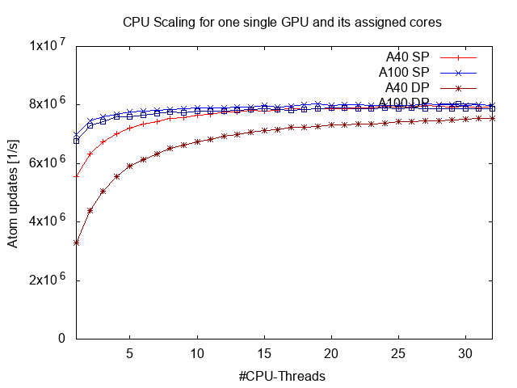

<!-----------------------------------------------------------------------------
This document should be written based on the Github flavored markdown specs:
https://github.github.com/gfm/
It can be converted to html or pdf with pandoc:
pandoc -s -o logbook.html  -f gfm -t html logbook.md
pandoc test.txt -o test.pdf
or with the kramdown converter:
kramdown --template document  -i GFM  -o html logbook.md

Optional: Document how much time was spent. A simple python command line tool
for time tracking is [Watson](http://tailordev.github.io/Watson/).
------------------------------------------------------------------------------>

# MuCoSim: MD-Bench on Cuda
[TOC]
## Project Description

### Customer Info

* Name: Martin Bauernfeind
* E-Mail: [martin.m.bauernfeind@fau.de](mailto:martin.m.bauernfeind@fau.de)

-----

### Application Info

* Code: MD-Bench on Cuda
* URL: https://github.com/RRZE-HPC/MD-Bench/tree/mucosim_cuda

The original MD-Bench is a mini-app to simulate molecular dynamics.
Its code is written in sequential C with less than 1000 lines of code.
MD-Bench on Cuda is aimed to port this code to Cuda to use the power of massive parallelism on GPGPUs.
Even though many parts are already ported to Cuda, significant parts still remain in C and therefore on the CPU.

*Note: The words particle and atom will be used interchangeably

-----

MD-Bench emulates such molecular dynamics by calculating the interactions among particles and how these affect their motion.
The simulation system's constituents are
* Number of atoms with initial state (position & velocity)
* Boundary conditions (periodic)


-----

force computation between atom: 
* based on the Lennard-Jones potential:
  * pairs of particles, here: electronically neutral atoms 
  * models repulsive as well as attractive interactions


where
* ***r*** is the distance between the two interacting atoms, 
* ***ε*** is the dispersion energy and
* ***σ*** the distance at which the particle-potential ***V*** is zero

-----

What can be observed from this graph is:
* The Lennard-Jones potential is a simplified model but still describes the essential aspects of particle dynamics
* Particles repel each other at close distances, attract each other at medium distances and have close to zero interaction at large distances
-----

The simulation runs similar to the sketch code below:
* every timestep iterate over all particles:
  * compute interactions with neighbors
  * integrate force generated by interaction

```python
for t in timesteps:
  #GPU-parallel-for atom in atoms:
    velocity[atom] += force[atom]
    position[atom] += velocity[atom]

  if t % 20 == 0:
    neighbors = calculateNeighbors()

  #GPU-parallel-for atom in atoms:
    neighbors = neighbors[atom]
    force = 0.0
    for neighbor in neighbors:
        radius = calc_radius(...)
        if radius < close_enough:
            force += calc_force(...)
    forces[atom] += force
```

Some parts already have been ported to GPU. More on that in a later chapter.

-----

### Testsystem

* Host/Clustername: alex
* Cluster Info URL: <https://hpc.fau.de/systems-services/systems-documentation-instructions/clusters/alex-cluster/>
* per node:
  * CPU: 2x AMD EPYC 7713 “Milan” (64 cores per chip) @ 2.0 GHz - SMT disabled -> 1 Thread/CPU
  * Memory capacity: [512 GB | 1024 GB | 512 GB]
  * GPU: [8x A100/40GB | 8x A100/80GB | 8x A40/48GB]
* Info on single node jobs: <https://hpc.fau.de/systems-services/systems-documentation-instructions/clusters/alex-cluster/#batch>
* resources per GPU:
  * [A40 | A100]
  * CPU: [16 / GPU | 16 / GPU]
  * Memory: [60GB / GPU | 120GB / GPU]
  
  
**Note**: each an A40 has about double the single precision processing power of an A100 despite being cheaper

-----
### Software Environment

**Compiler**:

* Compiler: NVCC (cuda/11.6.1)
* Operating System: Ubuntu 20.04.3 LTS
* Addition libraries:
  * LIKWID 5.2.0

### How to build software

```
$ git clone https://github.com/RRZE-HPC/MD-Bench/tree/mucosim_cuda
$ cd MD-Bench
$ module load likwid cuda
$ make
```

-----
### Testcase description

If not stated otherwise these are the conditions for the simulation benchmarking.
* the number of simulated atoms is 131072
* floating numbers use double precision
* force computation between atoms uses the lennard-jones model
* one gpu with its associated cores are used for computation

### How to run software

```
$ module load likwid cuda
$ cd MD-Bench
$ make
$ ./MDBench-NVCC
```
-----
## Initial: CPU Scaling runs
* one gpu with its associated 16 cores is fixed
* scale the number of CPU-Threads
* output of our programm contains line displaying throughput in number of atom updates per second:
```
Performance: 7.18 million atom updates per second
```
-----
Now we plot the single- and double-precision performance for linearly increasing numbers of `NUM_THREADS` from 1 to 32:



Similar convergence points in performance between the A40 and A100 hints at bottlenecks independent of the gpu.

-----
## Profiling the application

In order to find such a bottleneck the runtime behaviour of the application is monitored with the command line tool `nsys`:
```
srun nsys profile -o ./a40_profiling_run
```


* activity is cyclic
* most of the time is spent with only one CPU active
* short blue parts are where the GPU is active

-----
### Finding where the CPU time is spent

Using the command line tool `gprof` we can see that most of the CPU time is in the buildNeighbor-function


```
Flat profile:

Each sample counts as 0.01 seconds.
  %      self              total           
 time   seconds    calls  ms/call  name    
 97.70     3.35       11   306.47  buildNeighbor
  0.87     0.03      201     0.15  updatePbc
  0.58     0.02  2359296     0.00  myrandom
  0.58     0.02       11     1.82  binatoms
  0.29     0.01       11     0.91  setupPbc
  0.00     0.00     1668     0.00  checkCUDAError
  0.00     0.00      426     0.00  getTimeStamp
  0.00     0.00      201     0.00  computeForce
  0.00     0.00      200     0.00  cuda_final_integrate
  0.00     0.00      200     0.00  cuda_initial_integrate
...
```
-----
The standard program output also tells us in how much time (in total for CPU and GPU) is used for neigbor selection and force computation. The numbers will probably not match perfectly since gprof only samples the CPU.

```
TOTAL 3.47s FORCE 0.21s NEIGH 3.15s REST 0.12s
```

Even when considering CPU and GPU time the neighbor calculation needs most of the time.

-----
### Reasons for this runtime profile

Recall code from earlier:

```python
for t in timesteps:
  #GPU-parallel-for atom in atoms:
    velocity[atom] += force[atom]
    position[atom] += velocity[atom]

  if t % 20 == 0:
    neighbors = calculate_neighbors()

  #GPU-parallel-for atom in atoms:
    neighbors = neighbors[atom]
    force = 0.0
    for neighbor in neighbors:
        radius = calc_radius(...)
        if radius < close_enough:
            force += calc_force(...)
    forces[atom] += force
```
-----
## Parallelizing neighborhood calculation

* real application simulates a 3D space
* examples written in pseudo-python assume a 2D space

```python
def calculate_neighbors():
  update_according_to(atoms, periodic_boundary_condition)
  setup_periodic_boundary_condition(atoms, periodic_boundary_condition)
  update_periodic_boundary_condition(atoms, periodic_boundary_condition)
  neighbor_list = build_neighbor(atoms)
  return neighbor_list
``` 
-----
### Perodic boundary condition

Atoms leaving the simulated area will enter on the mirrored side. In code it looks like this:

```python
def update_according_to(atoms, periodic_boundary_condition):
  sim_width, sim_height = periodic_boundary_condition.simulated_area.dims
  x_max, x_min, y_max, y_min = periodic_boundary_condition.boundaries
  for atom in atoms:
    if position[atom].x > x_max:
      position[atom].x -= sim_width
    if position[atom].x < x_min:
      position[atom].x += sim_width
    if position[atom].y > y_max:
      position[atom].y -= sim_height
    if position[atom].y < y_min:
      position[atom].y += sim_height
```
* all iterations indendent -> easy to parallelize
* one thread per atom for simplicity (GPU threads are quite lightweight)

-----
#### Atoms near the periodic border
Create ghost atoms on other side to emulate force interactions through the periodic border

```python
def setup_periodic_boundary_condition(atoms, periodic_boundary_condition):
  sim_width, sim_height = periodic_boundary_condition.simulated_area.dims
  x_max, x_min, y_max, y_min = periodic_boundary_condition.boundaries
  n_ghosts = 0
  n_ghost_allocations = some_value
  ghosts = malloc(n_ghost_allocations * sizeof(ghost))
  
  def createGhost(original_atom, offset_x, offset_y):
    ghost = {}
    ghost.original = original_atom
    ghost.offset_x = offset_x
    ghost.offset_y = offset_y
    return ghost
  
  for atom in atoms:
    if n_ghost_allocations - n_ghosts < max_ghosts_created_per_iteration:
      ghosts = realloc(ghosts, n_ghost_allocations, n_ghost_allocations + some_more)
      n_ghost_allocations += some_more
    if position[atom].x > x_max - threshold:
      ghosts[n_ghosts++] = createGhost(atom, -sim_width, 0)
    if position[atom].x < x_min + threshold:
      ghosts[n_ghosts++] = createGhost(atom, +sim_width, 0)
    if position[atom].y > y_max - threshold:
      ghosts[n_ghosts++] = createGhost(atom, 0, -sim_height)
    ...
    if position[atom].x < x_min + threshold AND position[atom] < y_min + threshold:
      ghosts[n_ghosts++] = createGhost(atom, +sim_width, +sim_height)
  
  if n_atoms + n_ghosts > len(atoms):
    atoms = realloc(n_atoms + n_ghosts)
```

* iterations depend on each other via the n_ghosts variable -> parallelizing will be difficult

Ideas to parallelize:
allocate more space for ghosts than will be needed and give each atom a thread
* each thread inserts its atoms ghosts into a predefined empty space 
  * -> no collisions but array will be sparsely occupied
* each thread atomically increments a global counter (mimicing the nghosts variable) 
  * -> no collisions and dense array occupation, but atomicAdd might lead to lots of blocking

-----
#### Updating the ghost atom positions

```python
def update_bondary_condition(atoms, periodic_boundary_condition):
  for ghost in ghosts:
    position[ghost].x = ghost.offset_x + position[ghost.original].x
    position[ghost].y = ghost.offset_y + position[ghost.original].y
```

* iterations independent
  * -> easy to parallelize
  * -> one thread per atom

### Building neighbor lists
* majority of time is spent here
  * parallelizing will probably reduce runtime sigificantly

```python
def buildNeighbor(atoms):
  max_neighbors_per_atom = some_value
  new_max_neighbors_per_atom = max_neighbors_per_atom
  grid_cells = sort_into(atoms)
  neighbor_list = malloc(n_atoms * max_neighbors * sizeof(int))
  neighbor_counters = malloc(n_atoms * sizeof(int))
  
  resize_needed = true
  while(resize_needed):
    new_max_neighbors_per_atom = max_neighbors_per_atom
    resize_needed = false
    for atom in atoms:
      neighbor_count = 0
      grid_cell = grid_cell_of(position[atom])
      for neighboring_cell in neighboring_cells(grid_cell):
        for possible_neighbor in neighboring_cell.atoms:
          if distance(atom, possible_neighbor) < threshold:
            neighbor_list[atom * max_neighbors_per_atom + neighbor_count] = possible_neighbor
            neighbor_count++
      if neighbor_count > max_neighbors_per_atom:
        resize_needed = true
        if neighbor_count > new_max_neighbor_count_per_atom:
          new_max_neighbor_count_per_atom = neighbor_count
    if resize_needed:
      max_neighbors_per_atom = new_max_neighbors_per_atom * 1.2
      free(neighbor_list)
      neihgbor_list = malloc(n_atoms * max_neighbors * sizeof(int))
```
* iterations over atoms are output dependent on each other iff neighbor lists are longer than the individually allocated space

## Next goals
ordered by priority
* port the buildNeighbor-function to Cuda (reduced Host-To-Device traffic, reduced computation time)
* port the function updating the ghost atoms to Cuda
* port the creating the ghost atoms to Cuda

* evaluate performance along the way
