<!-----------------------------------------------------------------------------
This document should be written based on the Github flavored markdown specs:
https://github.github.com/gfm/
It can be converted to html or pdf with pandoc:
pandoc -s -o logbook.html  -f gfm -t html logbook.md
pandoc test.txt -o test.pdf
or with the kramdown converter:
kramdown --template document  -i GFM  -o html logbook.md

If checked in as part of a github project html is automatically generated if
using the github web interface.

Optional: Document how much time was spent. A simple python command line tool
for time tracking is [Watson](http://tailordev.github.io/Watson/).
------------------------------------------------------------------------------>

<!-----------------------------------------------------------------------------
The Agenda section is a scratchpad area for planning and Todo list
------------------------------------------------------------------------------>
# Agenda

* Gather behavior:
    * What makes gathers slower?
        * Latency (distance between data and registers)
        * Cut cache lines between gathers for each dimension (gather on y dimension may require different cache line than for x)
        * Mapping between data and cache sets (most cache lines can be mapped to only a few cache sets)
    * Compare cache simulator with measurements from likwid (1 timestep)
    * Histogram for distances between neighbors to be gathered
* Compare HW. vs SW. gather strategies
* Implement EAM potential


<!--  -->

<!-----------------------------------------------------------------------------
START BLOCK PREAMBLE -  Global information required in all steps: Add all
information required to build and benchmark the application. Should be extended
and maintained during the project.
------------------------------------------------------------------------------>
# Project Description

* Start date: DD/MM/YYYY
* Ticket ID:
* Home HPC center:
* Contact HPC center:
   * Name: Rafael Ravedutti Lucio Machado
   * Fon: +49 9131 85 67296
   * E-Mail: rafael.r.ravedutti@fau.de

<!-----------------------------------------------------------------------------
Formulate a clear and specific performance target
------------------------------------------------------------------------------>
## Target

Performance analysis of the MD-Bench, a molecular dynamics mini-app based on miniMD. The main goal is to provide a performance model for molecular dynamics and evaluate the performance for different strategies on different targets.

<!-----------------------------------------------------------------------------
## Customer Info

* Name: <CUSTOMERNAME>
* E-Mail: john.doe@foo.bar
* Fon: <PHONENUMBER>
* Web: <URL>
------------------------------------------------------------------------------>

## Application Info

* Name: MD-Bench
* Domain: Molecular Dynamics
* Version: <VERSION>

<!-----------------------------------------------------------------------------
All steps required to build the software including dependencies
------------------------------------------------------------------------------>
## How to build software
* See README.md.
* Additional notes on the build process:
* **Used Compiler:**  
    * Intel Compiler - icc (ICC) 19.0.5.281 20190815
* **Compiler options:**
    * AVX512: -Ofast -xCORE-AVX512 -qopt-zmm-usage=high
    * AVX2: -fast -xCORE-AVX2


## Hardware
* **Cascade Lake** or **CLX**: Dual  Intel Xeon “Cascade Lake” Gold 6248 CPU (2x 20 cores + SMT) @ 2.50GHz, 384 GiB RAM
    * Unless specified, turbo mode is off and frequency is fixed at 2.4GHz
* **Ice Lake** or **ICX**: Dual Intel Xeon “Icelake” Platinum 8358 CPU (2x 32 cores + SMT) @ 2.60GHz, 256 GiB RAM
    * Unless specified, turbo mode is off and frequency is fixed at 2.4GHz
* **Skylake** or **SKX**: Intel Xeon “Skylake” Gold 6148 CPU (2x 20 cores + SMT) @ 2.40GHz, 96 GiB RAM
    * Unless specified, turbo mode is off and frequency is fixed at 2.401GHz
* **Broadwell** or **BDW**: Dual Intel Xeon “Broadwell” CPU E5-2697 v4 (2x 18 cores + SMT) @ 2.30GHz, 128 GiB RAM

<!-----------------------------------------------------------------------------
Describe in detail how to configure and setup the testcases(es)
------------------------------------------------------------------------------>
## Testcase description

There are two test cases available:

* **Standard:** Standard setup from miniMD (Cu FCC lattice), atoms are evenly distributed on unit cells (4 atoms per unit cell), and each atom contains about 64 neighbors on average. The number of unit cells can be specified as input parametes, the default is to run a system of 32x32x32 unit cells.

* **Stubbed:** Version to execute within cache sizes, the number of atoms per unit cells and the number of unit cells per dimensions can be specified. All atoms are just neighbors to other atoms in the same unit cell, hence the number of neighbors per atom is fixed as the number of atoms per unit cells minus 1. This allow us to derive some properties such as the ones described in the following picture:

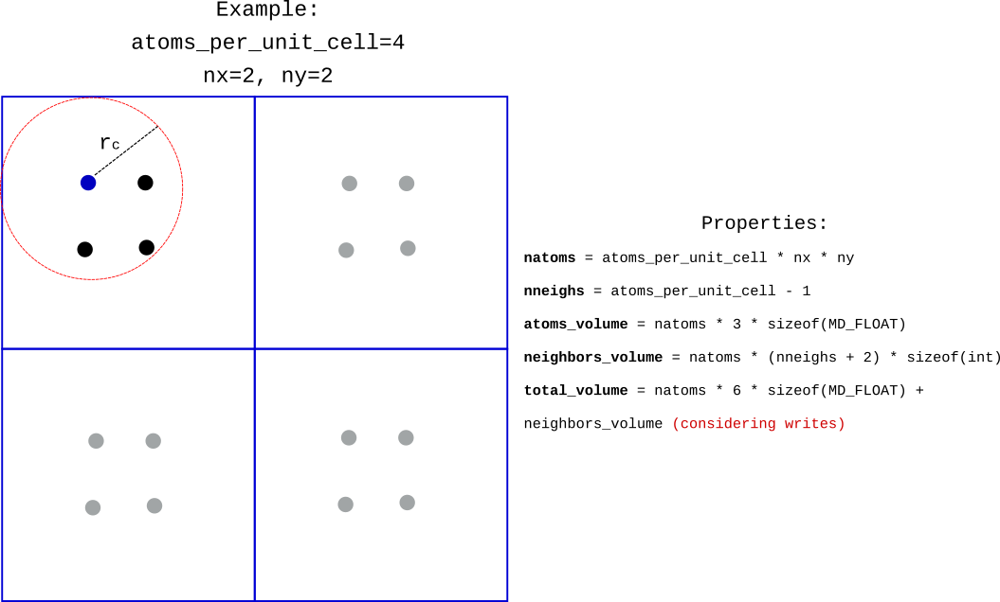

<!-----------------------------------------------------------------------------
All steps required to run the testcase and control affinity for application
------------------------------------------------------------------------------>
## How to run software

To compile the application, adjust the configurations in the `config.mk` file and use the `make` command, this generates the `MD-Bench-TAG` binary that runs the standard test cases. `TAG` specifies the compiler to be used and it can be either GCC, CLANG or ICC. To compile the stubbed force calculation, simply run `make VARIANT=md`, which generates the `MD-Bench-TAG-stub` binary. The available options for both binaries can be seen with the `-h` option.

<!-----------------------------------------------------------------------------
END BLOCK PREAMBLE
------------------------------------------------------------------------------>

<!-----------------------------------------------------------------------------
START BLOCK ANALYST - This block is required for any new analyst taking over
the project
# Transfer to Analyst: <NAME-TAG>

* Start date: DD/MM/YYYY
* Contact HPC center:
   * Name:
   * Fon:
   * E-Mail:
------------------------------------------------------------------------------>

<!-----------------------------------------------------------------------------
###############################################################################
START BLOCK BENCHMARKING - Run helper script machine-state.sh and store results
in directory session-<ID> named <hostname>.txt. Document everything that you
consider to be relevant for performance.
###############################################################################
------------------------------------------------------------------------------>
<!-----------------------------------------------------------------------------
## Benchmarking <NAME-TAG>

### Testsystem

* Host/Clustername:
* Cluster Info URL:
* CPU type:
* Memory capacity:
* Number of cores per node:
* Interconnect:

### Software Environment

**Compiler**:
* Vendor:
* Version:

**Libraries**:
* <LIBRARYNAME>:
   * Version:

**OS**:
* Distribution:
* Version:
* Kernel version:
------------------------------------------------------------------------------>

<!-----------------------------------------------------------------------------
Create a runtime profile. Which tool was used? How was the profile created.
Describe and discuss the runtime profile.
------------------------------------------------------------------------------>
## Runtime Profile <NAME-TAG>-<ID>

The structure of the main simulation loop is the following:

```C
for(int n = 0; n < param.ntimes; n++) {
  initialIntegrate(&param , &atom);
  if((n + 1) % param.every) {
    updatePbc(&atom, &param);
  } else {
    reneighbour(&param, &atom, &neighbor);
  }
  computeForce(&param, &atom , &neighbor);
  finalIntegrate (&param , &atom);
  if(!((n + 1) % param.nstat ) && (n + 1) < param.ntimes) {
    computeThermo(n + 1, &param , &atom);
  }
}
```

From complexity analysis, we should expect that the `reneighbour` and `computeForce` stages to be the most performance-critical ones.
For the runtime profile we print the time results for each stage separately, as this is also done in the original miniMD application.
Furthermore, the results displayed on casclakesp2 with array of structures (AoS) layout with AVX512 compilation flags are:

```
TOTAL 9.30s FORCE 4.81s NEIGH 4.25s REST 0.24s
```

This confirms our hypothesis, in this case the force computation is the most expensive part.
However, this can change according to the rebuild frequency and force-field used in the simulation.
Also, optimizing the force computation will turn the neighbor list creation to consume a bigger fraction of the overall time, hence both stages should be considered and properly optimized for efficient MD simulations.

<!-----------------------------------------------------------------------------
Perform a static code review.
------------------------------------------------------------------------------>
## Code review <NAME-TAG>-<ID>

To compute the forces, the code must traverse through all atoms in the system and their neighbors.
The force is computed for every pair of atoms and accumulated into the current atom's position.
Since we use the neighbor lists approach, the iteration over the neighbors is simply the iteration over the current atoms list.
The code can be seen below:

```C
for(int i = 0; i < Nlocal; i++) {
    neighs = &neighbor->neighbors[i * neighbor->maxneighs];
    int numneighs = neighbor->numneigh[i];
    MD_FLOAT xtmp = atom_x(i);
    MD_FLOAT ytmp = atom_y(i);
    MD_FLOAT ztmp = atom_z(i);
    MD_FLOAT fix = 0;
    MD_FLOAT fiy = 0;
    MD_FLOAT fiz = 0;

    for(int k = 0; k < numneighs; k++) {
        int j = neighs[k];
        MD_FLOAT delx = xtmp - atom_x(j);
        MD_FLOAT dely = ytmp - atom_y(j);
        MD_FLOAT delz = ztmp - atom_z(j);
        MD_FLOAT rsq = delx * delx + dely * dely + delz * delz;

        if(rsq < cutforcesq) {
            MD_FLOAT sr2 = 1.0 / rsq;
            MD_FLOAT sr6 = sr2 * sr2 * sr2 * sigma6;
            MD_FLOAT force = 48.0 * sr6 * (sr6 - 0.5) * sr2 * epsilon;
            fix += delx * force;
            fiy += dely * force;
            fiz += delz * force;
        }
    }

    fx[i] += fix;
    fy[i] += fiy;
    fz[i] += fiz;
}
```

To vectorize the code in the most internal loop, the data for the neighbors must be gathered into the vectors.
Consequently, instructions such as **vgather** or other that mimic its behavior must be used.
We resort to these strategies as hardware and software gathers, respectively.
In order to understand and detail the performance aspects of gathering the data for these kernels, we developed gather-bench (https://github.com/RRZE-HPC/gather-bench), a benchmark that performs gathering of data from arrays of different sizes in order to evaluate the L1, L2 and L3 cache scenarios.
The benchmark provides a simple array case and MD variants using Array of Structs (AoS) and Struct of Arrays (SoA) data layouts.

Additionaly to understanding the memory latency and bandwidth impacts, we also need to evaluate how the kernel executes on the CPU with respect to instruction throughput.
For that, we use the already mentioned stubbed force calculation, a benchmark that contains well known data access behavior and fixed amount of neighbors per atom.
This allow us to make the data size fit into the L1 cache (reduce latency impact) and derive some properties such as the number of cycles per atom.
Finally, we compare the executed measurements from the stubbed force calculation with OSACA and IACA predictions for the same kernel as a baseline.

For the Intel compiler generated assembly, three variants of the most three internal loop are generated (Consider ***rmng_neighs = numneighs - k***):

- **rmng\_neighs < 8:** last iteration, vectors are not fulfilled
- **rmng\_neighs in ]8, 1200]:** with lea+mov instructions (prefetching?), L1 case? 1200 * 3 * 8 =28.8kB, L1 cache size is 32kB on Cascade Lake
- **rmng\_neighs >= 1200:** no mov+lea instructions

Unless explicitly stated, our experiments make use of the **rmng\_neighs in ]8, 1200]** variant!

Regarding the mov+lea instructions, these can be perceived in the following snippet:

```Assembly
vmovdqu   ymm3, YMMWORD PTR [r13+rbx*4]         # ymm3 <- neighs[k]
vpaddd    ymm4, ymm3, ymm3                      # ymm4 <- neighs[k] * 2
vpaddd    ymm3, ymm3, ymm4                      # ymm3 <- neighs[k] * 3
# -------------------- mov+lea instructions (prefetching?) -----------------------
mov       r10d, DWORD PTR [r13+rbx*4]           # r10d <- neighs[k]
mov       r9d, DWORD PTR [4+r13+rbx*4]          # r9d  <- neighs[k + 1]
mov       r8d, DWORD PTR [8+r13+rbx*4]          # r8d  <- neighs[k + 2]
mov       esi, DWORD PTR [12+r13+rbx*4]         # esi  <- neighs[k + 3]
lea       r10d, DWORD PTR [r10+r10*2]           # r10d <- neighs[k] * 3
mov       ecx, DWORD PTR [16+r13+rbx*4]         # ecx  <- neighs[k + 4]
lea       r9d, DWORD PTR [r9+r9*2]              # r9d  <- neighs[k + 1] * 3
mov       edx, DWORD PTR [20+r13+rbx*4]         # edx  <- neighs[k + 5]
lea       r8d, DWORD PTR [r8+r8*2]              # r8d  <- neighs[k + 2] * 3
mov       eax, DWORD PTR [24+r13+rbx*4]         # edx  <- neighs[k + 6]
lea       esi, DWORD PTR [rsi+rsi*2]            # esi  <- neighs[k + 3] * 3
mov       r15d, DWORD PTR [28+r13+rbx*4]        # edx  <- neighs[k + 7]
lea       ecx, DWORD PTR [rcx+rcx*2]            # ecx  <- neighs[k + 4] * 3
lea       edx, DWORD PTR [rdx+rdx*2]            # edx  <- neighs[k + 5] * 3
lea       eax, DWORD PTR [rax+rax*2]            # eax  <- neighs[k + 6] * 3
lea       r15d, DWORD PTR [r15+r15*2]           # r15d <- neighs[k + 7] * 3
# -------------------- end of mov+lea instructions -------------------------------
vpcmpeqb  k1, xmm0, xmm0                        # k1    <- [true for all elements]
vpcmpeqb  k2, xmm0, xmm0                        # k2    <- [true for all elements]
vpcmpeqb  k3, xmm0, xmm0                        # k3    <- [true for all elements]
vpxord    zmm4, zmm4, zmm4                      # zmm4  <- 0.0
vpxord    zmm17, zmm17, zmm17                   # zmm17 <- 0.0
vpxord    zmm18, zmm18, zmm18                   # zmm18 <- 0.0
vgatherdpd zmm4{k1}, QWORD PTR [16+rdi+ymm3*8]  # zmm4  <- atom->x[j * 3 + 2]
vgatherdpd zmm17{k2}, QWORD PTR [8+rdi+ymm3*8]  # zmm17 <- atom->x[j * 3 + 1]
vgatherdpd zmm18{k3}, QWORD PTR [rdi+ymm3*8]    # zmm18 <- atom->x[j * 3]
```

The mov+lea instructions delimited do not interfere with the semantics of the code (the dest registers for lea are not used afterwards in the kernel), hence they are generated either by compilation faults or performance reasons.
On Cascade Lake, the performance results when removing these instructions are better:

```
With lea+mov:
TOTAL 9.30s FORCE 4.81s NEIGH 4.25s REST 0.24s
Without lea+mov:
TOTAL 8.95s FORCE 4.43s NEIGH 4.28s REST 0.24s
```

Therefore at least for this case, we can assure that it is a bad compiler decision to generate such instructions.

## gather-bench

In order to understand and experiment with all different gathering strategies, we developed **gather-bench**, a benchmark that contains different kernels which gather data from different places into the CPU registers. Currently, gather-bench provides the following variants:

**default:** Gather elements from simple uni-dimensional arrays with a specified stride. This variant focus on evaluating the performance of a single gather instruction in the target architecture.

**md:** Gather elements from an array of 3-dimensional vectors (hence each element is represented by 3 real values) with a specified stride. The variant allows to specify the data layout for the array (AOS or SOA) and is used to evaluate the performance of the three gathers (as used in MD codes) in the target architecture.

**md-trace:** This version also gather elements from an array of 3-dimensional vectors, but do not use a fixed stride for the elements. Instead, an index tracer is generated in MD-Bench with the **INDEX\_TRACER** option, and the files generated by the tracer are used as an input of this variant to simulate the same access pattern as in the MD case. This version is used to evaluate the performance of the gathers in the real MD cases (i.e. fitting the "randomness" of these cases into the benchmark) without the force instructions contribution.

Currently, the gather-bench can be executed on x86\_64 AVX2 and AVX512 processors, but support for other architectures should be provided in the future.
The kernels are developed in pure assembly to avoid compiler optimizations and to permit low-level tweaking of the code.
Our main focus is to understand which factors influence the "cost of gather" and how much they influence.

Until now we not only focused on fitting the data size into different cache levels, but also evaluating the performance based on number of cache lines touched.
Considering that the stride among the elements to be gathered is fixed and the data is properly aligned to the cache line sizes, the number of cache lines touched per gather on the simple array case can be expressed as:

<!-- https://latex.codecogs.com/gif.latex?min\left(max\left(\frac{stride%20*%20vector\_length}{cache\_line\_elements},%201\right),%20vector\_length\right) -->
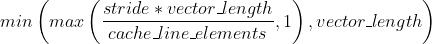

Where **stride** is the specified stride, **vector\_length** is the vector width of the CPU (in doubles) and **cache\_line\_elements** is the size of the cache line in the CPU (in doubles).

For the struct of arrays case, the number of cache lines touched is roughly **dims** times the number for the simple case (because data is gathered in the same fashion but for three distinct arrays), where **dims** is the number of dimensions to be gathered. For array of structures, the number of cache lines touched can be expressed as:

<!-- https://latex.codecogs.com/gif.latex?min\left(\frac{dims%20*%20stride%20*%20vector\_length}{cache\_line\_elements},%20vector\_length\right) -->
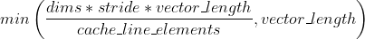

For our tests on Cascade Lake (**dims = 3, vector\_length = 8, cache\_line\_elements = 8**), it is noticeable from the previous equation that we only touch less cache lines in the cases where the stride is either 1 or 2.
The remaining cases do not benefit from touching less cache lines on the same dimension.
However, another point to consider is the number of cut cache lines for different dimensions of the same element.
If for instance the data for the ***x*** dimension is in one cache line and the data from ***y*** and ***z*** dimensions are in another one, we need to load two cache lines.
Since the number of cut cache lines is not too straightforward to determine, we count it during runtime with the following code snippet:

```C
#ifdef AOS
    const int cl_shift = log2_uint((unsigned int) cl_size);
    for(int i = 0; i < N; i++) {
        const int first_cl = (idx[i] * snbytes * sizeof(double)) >> cl_shift;
        const int last_cl = ((idx[i] * snbytes + gathered_dims - 1) * sizeof(double)) >> cl_shift;
        if(first_cl != last_cl) {
            cut_cl++;
        }
    }
#endif
```

Roughly speaking, the number of cut cache lines should be smaller when the stride is multiple of 4, which guarantees the alignment of the data, keeping the data from same element in the same cache line.
Another possibility to avoid cutting cache lines is to introducing a padding byte on 3-dimensions, which also keeps the data from the same element aligned with respect to the cache lines.

Finally, we list and describe the different options from **gather-bench** with respect to gathering strategies and measurements:

- **DATA\_TYPE:** Specify the precision of the real types (SP or DP).
- **DATA\_LAYOUT:** Specifies the data layout (AOS or SOA) for the MD variant.
- **PADDING:** Includes the padding byte (true or false) for elements.
- **MEASURE\_GATHER\_CYCLES:** measure cycles for each gather separately (true or false), since it requires memory fences it should be more suitable to measure and analyze the latency.
- **ONLY\_FIRST\_DIMENSION:** Gather data only for the first dimension (one gather per iteration), useful to isolate effects caused among gathers for other dimensions (such as the impact of cut cache lines).

<!-----------------------------------------------------------------------------
Application benchmarking runs. What experiment was done? Add results or
reference plots in directory session-<NAME-TAG>-<ID>. Number all sections
consecutivley such that every section has a unique ID.
------------------------------------------------------------------------------>

## Problem: Execution contribution

We want to obtain the execution contribution for the LJ kernel with the best memory transfer scenario (all data served from L1).
Hence we ran our stubbed force calculation version and obtain the following measurements:

### Measurement 1: MD-Bench stub in CLX with AoS data layout:

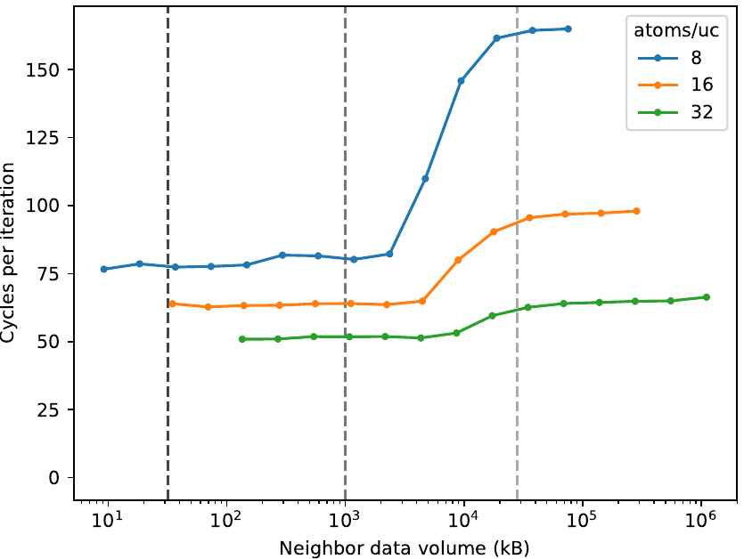

### Measurement 2: MD-Bench stub in CLX with SoA data layout:

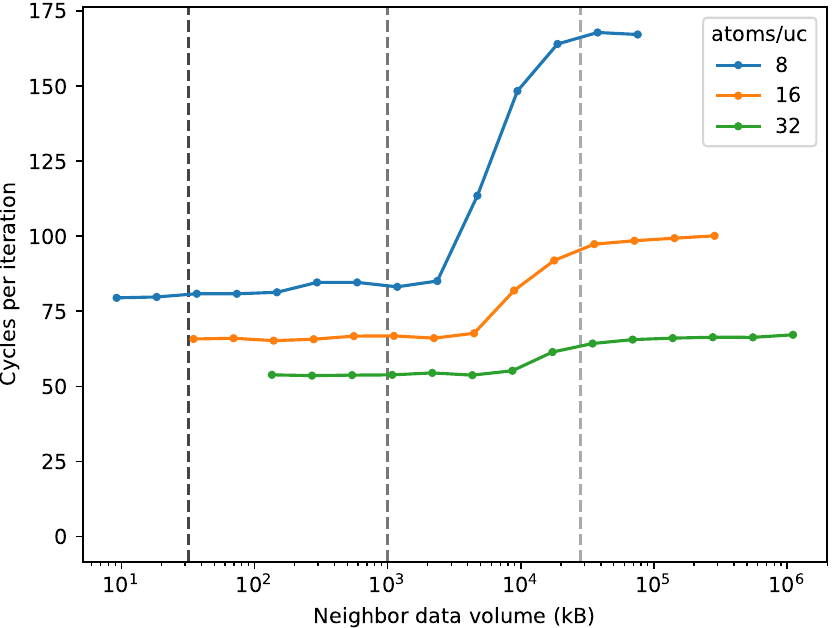

### Measurement 3: OSACA output for LJ innermost loop instructions on CLX with AoS data layout

```
Combined Analysis Report
------------------------
                                     Port pressure in cycles                                     
     |  0   - 0DV  |  1   |  2   -  2D  |  3   -  3D  |  4   |  5   |  6   |  7   ||  CP  | LCD  |
-------------------------------------------------------------------------------------------------
 261 |             |      |             |             |      |      |      |      ||      |      |   ..B1.25:                        # Preds ..B1.24
 262 |             |      |             |             |      |      |      |      ||      |      |   # Execution count [4.50e+00]
 263 | 0.00        | 0.00 |             |             |      | 0.00 | 1.00 |      ||  1.0 |  1.0 |   movq      %r8, %r13                                     #56.43
 264 |             | 1.00 |             |             |      |      |      |      ||  3.0 |  3.0 |   imulq     %rcx, %r13                                    #56.43
 265 |             |      |             |             |      | 1.00 |      |      ||      |      |   vbroadcastsd %xmm6, %zmm2                               #58.23
 266 |             |      |             |             |      | 1.00 |      |      ||      |      |   vbroadcastsd %xmm7, %zmm1                               #59.23
 267 |             |      |             |             |      | 1.00 |      |      ||      |      |   vbroadcastsd %xmm12, %zmm0                              #60.23
...
 337 | 1.00        |      |             |             |      | 0.00 |      |      ||      |      |   vfmadd231pd %zmm23, %zmm25, %zmm9{%k2}                  #78.17
 338 | 1.00        |      |             |             |      | 0.00 |      |      ||      |      |   vfmadd231pd %zmm24, %zmm25, %zmm8{%k2}                  #79.17
 339 | 1.00        |      |             |             |      | 0.00 |      |      ||  4.0 |      |   vfmadd231pd %zmm26, %zmm25, %zmm11{%k2}                 #80.17
 340 | 0.00        | 0.00 |             |             |      | 0.00 | 1.00 |      ||      |      |   cmpl      %r14d, %r12d                                  #67.9
 341 |             |      |             |             |      |      |      |      ||      |      | * jb        ..B1.26       # Prob 82%                      #67.9
 342 |             |      |             |             |      |      |      |      ||      |      |   # LOE rbx rbp rdi r13 r11d r12d r14d xmm6 xmm7 xmm12 ymm15 ymm16 zmm0 zmm1 zmm2 zmm5 zmm8 zmm9 zmm10 zmm11 zmm13 zmm14

       21.0          11.2   17.0   6.50   17.0   6.50   7.00   17.0   8.83   7.00    75.0   10.0 


Loop-Carried Dependencies Analysis Report
-----------------------------------------
 287 |  6.0 | lea       (%r10,%r10,2), %r10d                          #69.36| [269, 283, 287]
 291 | 10.0 | lea       (%r8,%r8,2), %r8d                             #69.36| [263, 264, 269, 285, 291]
 295 |  9.0 | lea       (%rcx,%rcx,2), %ecx                           #69.36| [264, 269, 288, 295]
 314 |  1.0 | addl      $8, %r12d                                     #67.9| [314]
 339 |  4.0 | vfmadd231pd %zmm26, %zmm25, %zmm11{%k2}                 #80.17| [339]
 338 |  4.0 | vfmadd231pd %zmm24, %zmm25, %zmm8{%k2}                  #79.17| [338]
 337 |  4.0 | vfmadd231pd %zmm23, %zmm25, %zmm9{%k2}                  #78.17| [337]
```

### Measurement 4: OSACA output for LJ innermost loop instructions on CLX with SoA data layout

```
Combined Analysis Report
------------------------
                                     Port pressure in cycles                                     
     |  0   - 0DV  |  1   |  2   -  2D  |  3   -  3D  |  4   |  5   |  6   |  7   ||  CP  | LCD  |
-------------------------------------------------------------------------------------------------
 253 |             |      |             |             |      |      |      |      ||      |      |   # LOE rax rdx rcx rbp rsi rdi r8 r10 r11 r12 r14 ebx r9d r13d xmm8 xmm9 xmm10 ymm17 ymm18 zmm0 zmm1 zmm2 zmm7 zmm11 zmm12 zmm13 zmm14 zmm15 zmm16 zmm19
 254 |             |      |             |             |      |      |      |      ||      |      |   ..B1.22:                        # Preds ..B1.22 ..B1.21
 255 |             |      |             |             |      |      |      |      ||      |      |   # Execution count [2.50e+01]
 256 |             |      |             |             |      |      |      |      ||      |      | X vpcmpeqb  %xmm0, %xmm0, %k2                             #70.36
 257 | 0.00        | 0.50 |             |             |      | 0.00 | 0.50 |      ||      |      |   addl      $8, %r9d                                      #67.9
 258 |             |      |             |             |      |      |      |      ||      |      | X vpcmpeqb  %xmm0, %xmm0, %k1                             #69.36
 259 |             |      |             |             |      |      |      |      ||      |      | X vpcmpeqb  %xmm0, %xmm0, %k3                             #71.36
...
 289 | 0.00        |      |             |             |      | 1.00 |      |      ||      |      |   vfmadd231pd %zmm28, %zmm30, %zmm13{%k5}                 #78.17
 290 | 0.00        |      |             |             |      | 1.00 |      |      ||      |  4.0 |   vfmadd231pd %zmm29, %zmm30, %zmm12{%k5}                 #79.17
 291 | 0.00        |      |             |             |      | 1.00 |      |      ||  4.0 |      |   vfmadd231pd %zmm31, %zmm30, %zmm11{%k5}                 #80.17
 292 | 0.00        | 0.50 |             |             |      | 0.00 | 0.50 |      ||      |      |   cmpl      %ebx, %r9d                                    #67.9
 293 |             |      |             |             |      |      |      |      ||      |      | * jb        ..B1.22       # Prob 82%                      #67.9

       17.5          3.00   13.0   2.50   13.0   2.50          17.5   3.00           68.0    4   


Loop-Carried Dependencies Analysis Report
-----------------------------------------
 257 |  1.0 | addl      $8, %r9d                                      #67.9| [257]
 261 |  1.0 | addq      $8, %r14                                      #67.9| [261]
 290 |  4.0 | vfmadd231pd %zmm29, %zmm30, %zmm12{%k5}                 #79.17| [290]
 289 |  4.0 | vfmadd231pd %zmm28, %zmm30, %zmm13{%k5}                 #78.17| [289]
 291 |  4.0 | vfmadd231pd %zmm31, %zmm30, %zmm11{%k5}                 #80.17| [291]
```

### Measurement 5: IACA output for LJ innermost loop instructions on SKX with AoS data layout

```
Throughput Analysis Report
--------------------------
Block Throughput: 36.70 Cycles       Throughput Bottleneck: Backend
Loop Count:  23
Port Binding In Cycles Per Iteration:
--------------------------------------------------------------------------------------------------
|  Port  |   0   -  DV   |   1   |   2   -  D    |   3   -  D    |   4   |   5   |   6   |   7   |
--------------------------------------------------------------------------------------------------
| Cycles | 17.5     0.0  | 11.0  | 20.5    17.0  | 20.5    17.0  |  7.0  | 20.5  |  7.0  |  0.0  |
--------------------------------------------------------------------------------------------------
```

### Measurement 6: IACA output for LJ innermost loop instructions on SKX with SoA data layout

```
Throughput Analysis Report
--------------------------
Block Throughput: 30.25 Cycles       Throughput Bottleneck: Backend
Loop Count:  23
Port Binding In Cycles Per Iteration:
--------------------------------------------------------------------------------------------------
|  Port  |   0   -  DV   |   1   |   2   -  D    |   3   -  D    |   4   |   5   |   6   |   7   |
--------------------------------------------------------------------------------------------------
| Cycles | 16.0     0.0  |  2.0  | 13.0    13.0  | 13.0    13.0  |  0.0  | 19.0  |  3.0  |  0.0  |
--------------------------------------------------------------------------------------------------
```

There is a high discrepancy between the IACA and OSACA predictions and the measured cycles for the stubbed force calculation.
The main reason for this is the fact that there is an overhead to fill the CPU pipeline with the instructions on the first iterations of the most internal loop, which increases the cycles per iteration.
Another factor that increases this discrepancy is that the whole time measurement also includes instructions within the outermost loop before entering the innermost loop (i.e. instructions for loading the first atom position data and its number of neighbors).
To mitigate both issues, we need to execute the most internal loop enough times in order to hide this overhead, hence we include a new loop in the code to just repeat the neighbor lists iteration:

```C
#if VARIANT == stub && defined(NEIGHBORS_LOOP_RUNS) && NEIGHBORS_LOOP_RUNS > 1
#define REPEAT_NEIGHBORS_LOOP
int nmax = first_exec ? 1 : NEIGHBORS_LOOP_RUNS;
for(int n = 0; n < nmax; n++) {
#endif

    for(int k = 0; k < numneighs; k++) {
        int j = neighs[k];
        MD_FLOAT delx = xtmp - atom_x(j);
        MD_FLOAT dely = ytmp - atom_y(j);
        MD_FLOAT delz = ztmp - atom_z(j);
        MD_FLOAT rsq = delx * delx + dely * dely + delz * delz;

        if(rsq < cutforcesq) {
            MD_FLOAT sr2 = 1.0 / rsq;
            MD_FLOAT sr6 = sr2 * sr2 * sr2 * sigma6;
            MD_FLOAT force = 48.0 * sr6 * (sr6 - 0.5) * sr2 * epsilon;
            fix += delx * force;
            fiy += dely * force;
            fiz += delz * force;
        }
    }

#ifdef REPEAT_NEIGHBORS_LOOP
}
#endif
```

This introduces the **NEIGHBORS\_LOOP\_RUNS** option in the MD-Bench configuration file, which is an integer that defines how many times the most internal loop must be repeated.

### Measurement 7: MD-Bench stubbed force calculation in CLX with AoS data layout, repeating the most internal loop 100 times:

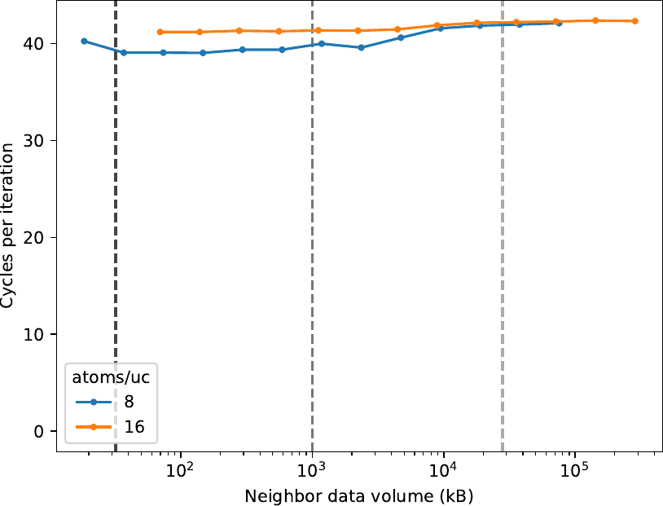

### Measurement 8: MD-Bench stubbed force calculation in CLX with SoA data layout, repeating the most internal loop 100 times:

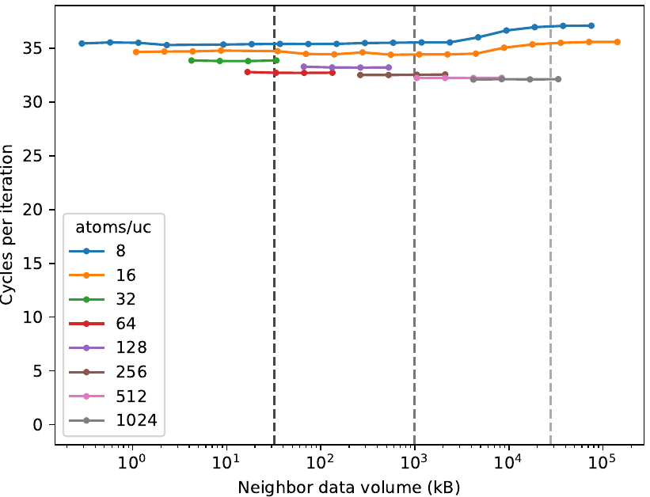

The new results get very close to the IACA predictions (about 5 cycles higher than them in both cases), hence these measurements are a good prediction for the instruction execution contribution of this LJ kernel.

## Problem: Memory contribution

We want to obtain the memory contribution (bandwidth and latency) for gathering the data from atoms positions.
First, we provide results using the gather benchmark (default and md variant) on different scenarios: with and without padding byte, with and without prefetchers and performing gather for only one dimension on the md variant.

Second, we want to separate memory and instructions contributions in the MD-Bench standard case, we execute both the standard case and stubbed force calculation with the data fitting into the L1 cache.
We then compute the average cycles per SIMD iteration on both versions to evaluate and understand the effects emerged from latency and bandwidth.
In the other way around, we also compare the standard case execution with the md-trace variant performing the same data access pattern, evaluating the impact caused by presence of the LJ computation instructions.

### Measurement 1: gather-bench md variant on CLX with AoS data layout

Raw data: [csv](raw_data/gather_md_aos_casclakesp2.csv) | [txt](raw_data/gather_md_aos_casclakesp2.txt)
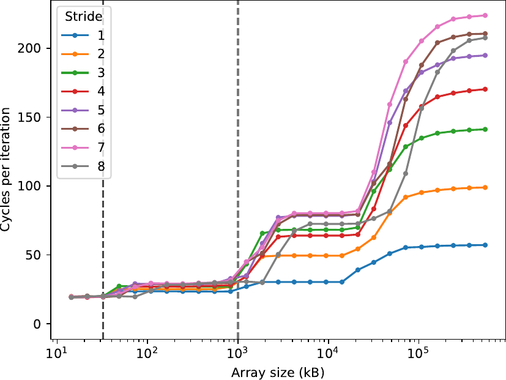

Raw data: [csv](raw_data/gather_md_aos_casclakesp2_more_sizes.csv) | [txt](raw_data/gather_md_aos_casclakesp2_more_sizes.txt)
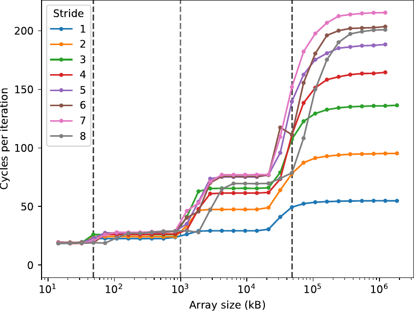

### Measurement 2: gather-bench md variant on CLX with AoS data layout and padding byte

Raw data: [csv](raw_data/gather_md_aos_casclakesp2_padding.csv) | [txt](raw_data/gather_md_aos_casclakesp2_padding.txt)
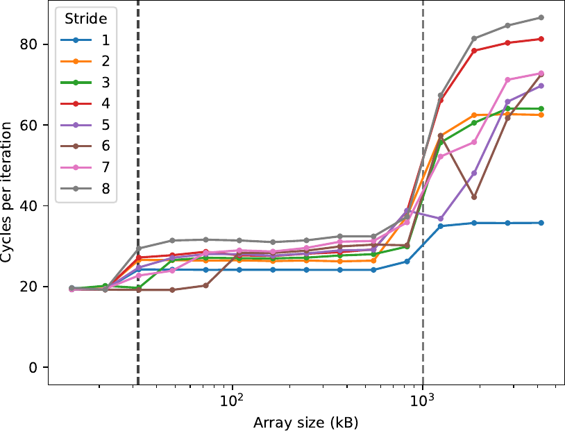

### Measurement 3: gather-bench md variant on CLX with AoS data layout and no prefetchers

Raw data: [csv](raw_data/gather_md_aos_casclakesp2_no_prefetchers.csv) | [txt](raw_data/gather_md_aos_casclakesp2_no_prefetchers.txt)
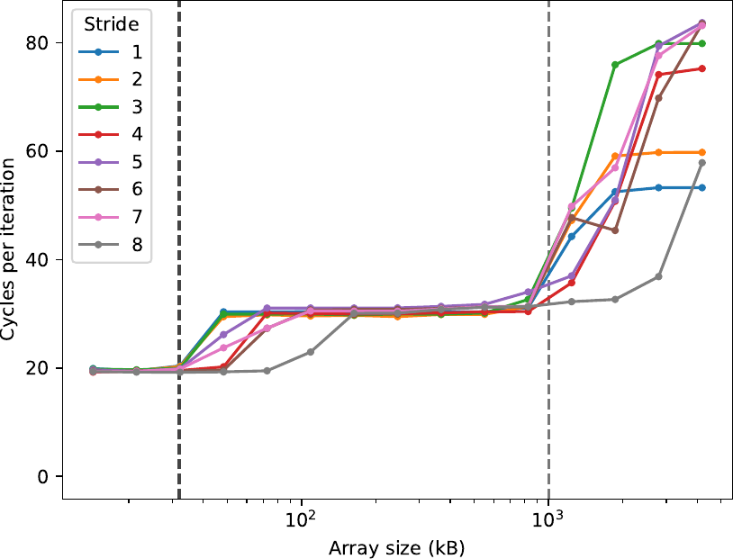

### Measurement 4: gather-bench md variant on CLX with AoS data layout gathering data only on the x dimension

Raw data: [csv](raw_data/gather_md_aos_casclakesp2_one_dim.csv) | [txt](raw_data/gather_md_aos_casclakesp2_one_dim.txt)
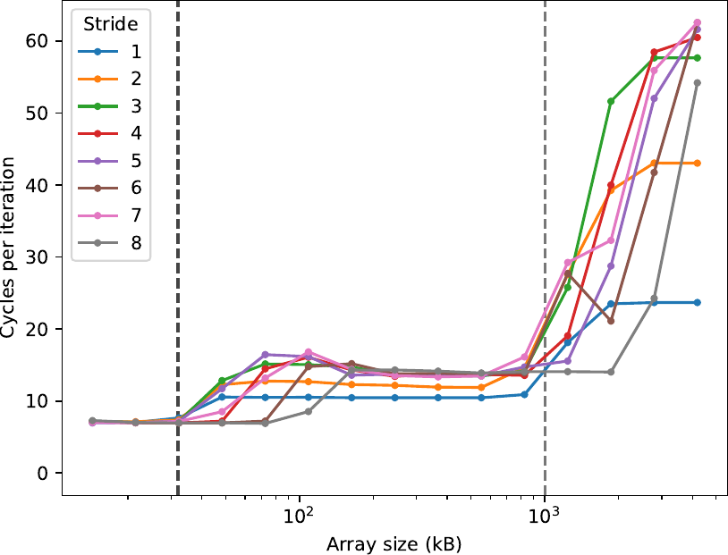

### Measurement 5: gather-bench md variant on CLX with SoA data layout

Raw data: [csv](raw_data/gather_md_soa_casclakesp2.csv) | [txt](raw_data/gather_md_soa_casclakesp2.txt)
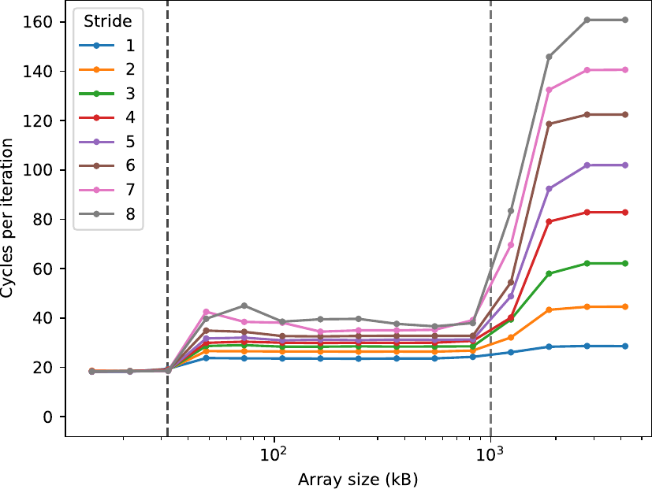

### Measurement 6: gather-bench md variant on ICX with AoS data layout

Raw data: [csv](raw_data/gather_md_aos_icx32.csv) | [txt](raw_data/gather_md_aos_icx32.txt)
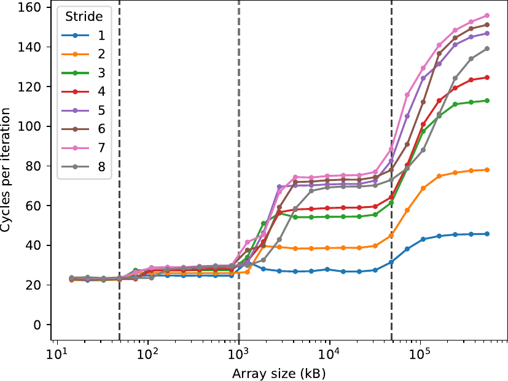

Raw data: [csv](raw_data/gather_md_aos_icx32_more_sizes.csv) | [txt](raw_data/gather_md_aos_icx32_more_sizes.txt)
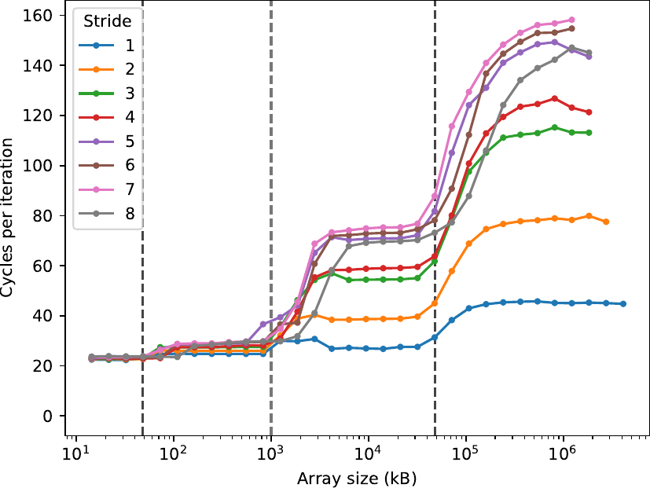

### Measurement 7: gather-bench md variant on ICX with AoS data layout and padding byte

Raw data: [csv](raw_data/gather_md_aos_icx32_padding.csv) | [txt](raw_data/gather_md_aos_icx32_padding.txt)
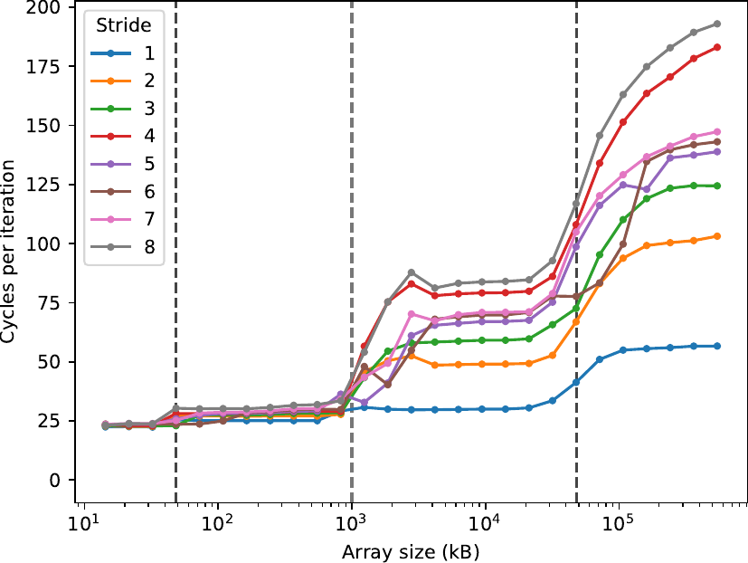

### Measurement 8: gather-bench md variant on ICX with AoS data layout gathering data only on the x dimension

Raw data: [csv](raw_data/gather_md_aos_icx32_one_dim.csv) | [txt](raw_data/gather_md_aos_icx32_one_dim.txt)
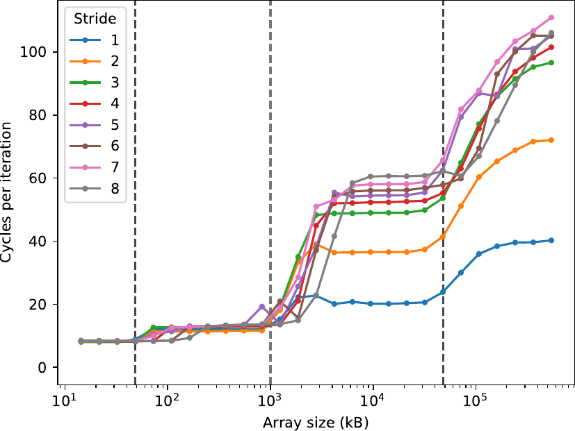

### Measurement 9: Statistics when running standard MD-Bench case on CLX

```
iwia021h@casclakesp2:~/repo/MD-Bench$ ./MDBench-ICC -f 2.4
Running without Marker API. Activate Marker API with -m on commandline.
step	temp		pressure
0	1.440000e+00	1.215639e+00
100	8.200895e-01	6.923143e-01
200	7.961495e-01	6.721043e-01
----------------------------------------------------------------------------
Data layout for positions: AoS
Using double precision floating point.
----------------------------------------------------------------------------
System: 131072 atoms 47265 ghost atoms, Steps: 200
TOTAL 20.03s FORCE 14.15s NEIGH 5.09s REST 0.79s
----------------------------------------------------------------------------
Performance: 1.31 million atom updates per second
Statistics:
	Vector width: 8, Processor frequency: 2.4000 GHz
	Total number of computed pair interactions: 2003182862
	Total number of SIMD iterations: 261297661
	Useful read data volume for force computation: 57.46GB
	Cycles/SIMD iteration: 129.9762
```

### Measurement 10: Statistics when running MD-Bench stubbed force calculation on CLX with data fitting into L1

Since the data set must not be too large for data to fit in the L1 cache, we may not obtain accurate results if the overall force kernel is not executed enough times.
This could be solved by increasing the timestep but this would also execute other steps such as the integration and occasionally the neighbor lists build.
These other steps can definitely harm the measurements for the force because they require different code paths and memory locations to be touched.
In order to mitigate this we then repeat the outermost loop of the simulation (the atoms loop) enough times to provide accurate results while keeping the execution in the same code path and loading the same data locations.
This introduces the **ATOMS\_LOOP\_RUNS** option in the MD-Bench configuration file, which is an integer that defines how many times the most internal loop must be repeated.

```
iwia021h@casclakesp2:~/repo/MD-Bench$ ./MDBench-ICC-stub -f 2.4
Running without Marker API. Activate Marker API with -m on commandline.
Number of timesteps: 200
Number of times to compute the atoms loop: 1000
Number of times to compute the neighbors loop: 1
System size (unit cells): 4x4x2
Atoms per unit cell: 8
Total number of atoms: 256
Estimated total data volume (kB): 21.5040
Estimated atom data volume (kB): 6.1440
Estimated neighborlist data volume (kB): 9.2160
Total time: 1.6652, Mega atom updates/s: 30.7475
Cycles per atom: 78.0550, Cycles per neighbor: 11.1507
Statistics:
	Vector width: 8, Processor frequency: 2.4000 GHz
	Total number of computed pair interactions: 358401792
	Total number of SIMD iterations: 51200256
	Useful read data volume for force computation: 10.04GB
	Cycles/SIMD iteration: 78.0546
```

<!-----------------------------------------------------------------------------
Document the initial performance which serves as baseline for further progress
and is used to compute the achieved speedup. Document exactly how the baseline
was created.
## Baseline

* Time to solution:
* Performance:


------------------------------------------------------------------------------>
<!-----------------------------------------------------------------------------
Explain which tool was used and how the measurements were done. Store and
reference the results. If applicable discuss and explain profiles.
## Performance Profile <NAME-TAG>-<ID>.2
------------------------------------------------------------------------------>

<!-----------------------------------------------------------------------------
Analysis and insights extracted from benchmarking results. Planning of more
benchmarks.
## Analysis <NAME-TAG>-<ID>.3
------------------------------------------------------------------------------>


<!-----------------------------------------------------------------------------
Document all changes with  filepath:linenumber and explanation what was changed
and why. Create patch if applicable and store patch in referenced file.
## Optimisation <NAME-TAG>-<ID>.4: <DESCRIPTION>
------------------------------------------------------------------------------>


<!-----------------------------------------------------------------------------
###############################################################################
END BLOCK BENCHMARKING
###############################################################################
------------------------------------------------------------------------------>

<!-----------------------------------------------------------------------------
Wrap up the final result and discuss the speedup.
Optional: Document how much time was spent. A simple python command line tool
for time tracking is [Watson](http://tailordev.github.io/Watson/).
------------------------------------------------------------------------------>
<!-----------------------------------------------------------------------------
## Summary

* Time to solution:
* Performance:
* Speedup:

## Effort

* Time spent:

------------------------------------------------------------------------------>
<!-----------------------------------------------------------------------------
END BLOCK ANALYST
------------------------------------------------------------------------------>

<!-----------------------------------------------------------------------------
START BLOCK SUMMARY - This block is only required if multiple analysts worked
on the project.
------------------------------------------------------------------------------>
<!-----------------------------------------------------------------------------
# Overall Summary

* End date: DD/MM/YYYY

## Total Effort

* Total time spent:
* Estimated core hours saved:
------------------------------------------------------------------------------>
<!-----------------------------------------------------------------------------
END BLOCK SUMMARY
------------------------------------------------------------------------------>
